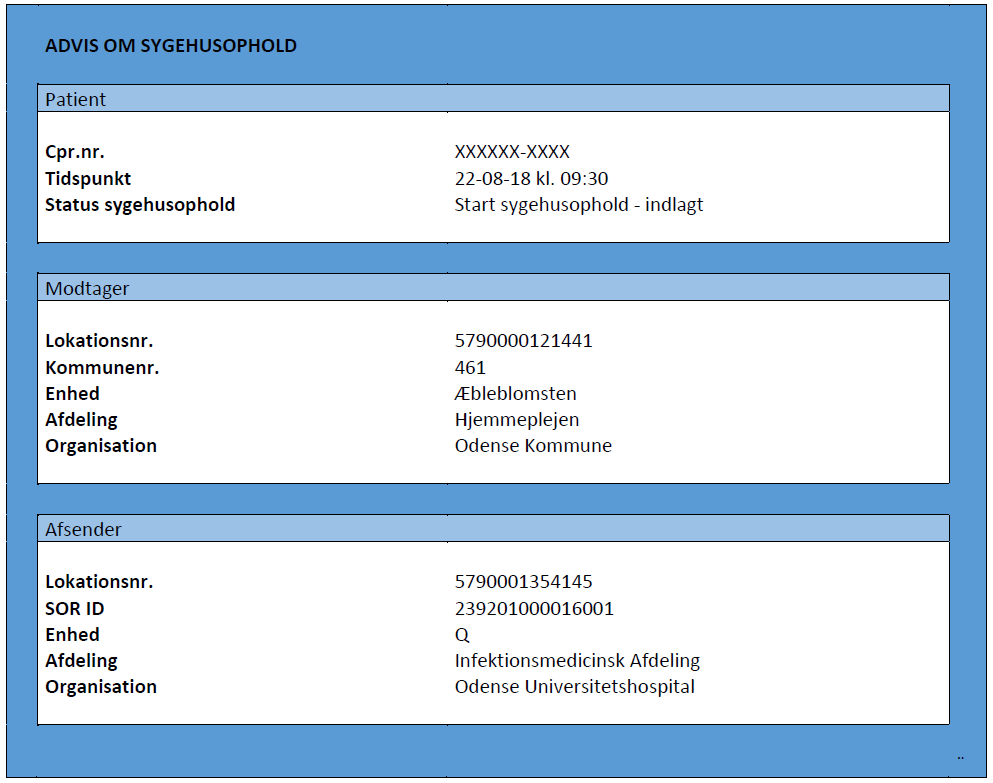

[Tilbage](../../index.md)

# Sundhedsfaglige retningslinjer for anvendelse

**Indholdsfortegnelse**
- [1 Introduktion](#1-introduktion)
- [2 Formål](#formaal)
- [3 Baggrund](#3-baggrund)
- [4 Lovgrundlag](#4-lovgrundlag)
- [5 Indhold og funktionalitet](#5-indhold-og-functionalitet)
- [6 Forretningsregler for anvendelse](#6-forretningsregler-for-anvendelse)
- [7 Eksempel](#eksampel)
<!-- - [7 Release Notes](#7-release-notes) -->

> Note: I tilfælde af uoverensstemmelser mellem det danske og det engelske dokumentation, er det danske dokumentation det gældende dokument. 

## 1 Introduktion 
Her beskrives de sundhedsfaglige retningslinjer for anvendelse af standarden ’Advis om sygehusophold’. Dette omfatter formål, baggrund, lovgrundlag for udveksling samt indhold og funktionalitet for ’Advis om sygehusophold’. Målgruppen er it-systemleverandører, og implementeringsansvarlige i regioner og kommuner, som skal it-understøtte afsendelse og modtagelse af Advis om sygehusophold’. ’Advis om sygehusophold’ erstatter de tidligere MedCom standarder indlæggelsesadvis <a href="https://svn.medcom.dk/svn/releases/Standarder/Det%20gode%20kommuneadvis/EDI/Dokumentation/" target="_blank">DIS20 </a> /<a href="https://svn.medcom.dk/svn/releases/Standarder/Det%20gode%20kommuneadvis/XDIS20/Dokumentation/" target="_blank">XDIS20</a>, og udskrivningsadvis <a href="https://svn.medcom.dk/svn/releases/Standarder/Det%20gode%20kommuneadvis/EDI/Dokumentation/" target="_blank">DIS17</a>/<a href="https://svn.medcom.dk/svn/releases/Standarder/Det%20gode%20kommuneadvis/XDIS17/Dokumentation/" target="_blank">XDIS17</a>. 

Bemærk, at der til brug for den tekniske implementering, er der udarbejdet en række use cases, hvor funktionaliteter og forretningsregler for anvendelse er omsat til en række detaljerede use cases for hhv. afsender- og modtagersystemer.  <a href="https://medcomdk.github.io/dk-medcom-hospitalnotification/#12-use-cases">Klik her for at læse use cases. </a> 
Bemærk også, at det totale indhold er beskrevet i de tekniske specifikationer.  [Klik her for at læse de tekniske specifikationer.](assets/documents/Intro-Technical-Spec-ENG.md) 

## 2 Formål {#formaal}
Advis om sygehusophold er en central og forretningskritisk meddelelse, som – på automatisk vis - informerer borgerens aktuelle omsorgs- og sundhedsaktører i kommunen om, at en borger hhv. opholder sig på sygehuset (akut ambulant eller indlagt) og senere hen afsluttes. Det giver borgerens aktører i kommunen mulighed for at pausere borgerens aktuelle ydelser under sygehusopholdet og igangsætte dem, når det ophører. Advis om sygehusophold’ kan desuden trigge automatisk afsendelse af en indlæggelsesrapport (<a href="https://svn.medcom.dk/svn/releases/Standarder/National%20Sygehus-Kommunesamarbejde/1.0.3/XDIS16/Dokumentation/" target="_blank">XDIS16</a>) fra modtagers system, som giver sygehuspersonalet et overblik over borgerens aktuelle ydelser, funktionsniveau og sundhedsfaglige problemer. Advis om sygehusophold sikrer, at de forretningsmæssige behov for advisering understøttes og omfatter advisering ved:
*	Indlæggelse
*	Akut ambulant sygehusophold
*	Orlov – start og slut
*	Afslutning til hjemmet/primær sektor.

## 3 Baggrund 
I takt med, at flere og flere patienter ikke indlægges, men opholder sig akut ambulant på sygehuset, er der opstået et behov for advisering om også borgere, som opholder sig akut ambulant på sygehuset.
Arbejdet med Advis om sygehusophold blev igangsat i 2018 i regi af MedComs <a href="https://www.medcom.dk/opslag/navne-og-adresser?gruppe=Hjemmepleje-sygehusgruppe" target="_blank"> hjemmepleje-sygehusgruppe </a> og <a href ="https://www.medcom.dk/opslag/navne-og-adresser?gruppe=Kommune-Sygehusleverand%C3%B8rgruppen" target="_blank">kommune-sygehusleverandørgruppe</a>, som har defineret krav til indhold og sundhedsfaglige retningslinjer for anvendelse. 
<b>Bemærkning vedr. LPR3:</b> Registrering af sygehusophold i EPJ-systemet har sammenhæng til indberetning til landspatientregisteret, LPR. Ved overgang til LPR3 (2019) er begreberne indlagt og ambulant ophævet i indberetningen til LPR, og erstattet af fysisk fremmøde. I praksis fortsætter alle regioner med registrering af sygehusophold som hhv. ambulant og indlagt. Det er aftalt mellem parterne bag udvikling af moderniseret sygehusadvis, at rammen for de sygehusophold, som skal advis understøttes, er:
<em>”Alle akutte sygehusophold med patientens fysiske fremmøde, samt alle planlagte sygehusophold med patientens fysiske fremmøde mhp. Indlæggelse”.</em>

## 4 Lovgrundlag
Adviser om sygehusophold udveksles med baggrund i Sundhedsloven og Retssikkerhedslovens §12c:

<em>”Til brug for tilrettelæggelsen af omsorgsopgaver m.v. efter § 79 a, kapitel 16 og §§ 107 og 108 i lov om social service og sundhedsloven samt til brug for opfølgning af sager efter §§ 8-10 i lov om sygedagpenge kan kommunalbestyrelser og sygehuse udveksle oplysninger om indlæggelse på og udskrivning fra sygehuse af borgere i kommunen og om borgerens akutte sygehusophold, hvor borgeren opholder sig på sygehuset til vurdering og behandling uden at være indlagt. Udvekslingen kan ske automatisk og uden borgerens samtykke.” </em> (Fra Retssikkerhedsloven 12c LBK nr. 265 af 25/02/2022)

Servicelovens §79 a omfatter *forebyggende hjemmebesøg*, kapitel 16 indeholder §§ 83-99, som omfatter *personlig hjælp, omsorg og pleje samt plejetestamenter,* og §§ 107 og 108 omfatter *midlertidige og længerevarende botilbud*. 

## 5 Indhold og functionalitet
Advis om sygehusophold afsendes automatisk og tidstro fra sygehusets EPJ-system til patientens bopælskommune. Da sygehuset ikke på forhånd kan afgøre hvilke borgere, der aktuelt modtager ydelser fra kommunen, dannes Advis om sygehusophold på alle borgere med cpr. nr. og fast bopælsadresse i Danmark ved registrering i sygehusets EPJ-system. Modtagersystemet skal sikre, at Advis om sygehusophold kun indlæses og synliggøres på borgere, som modtager ydelser indenfor det gældende lovgrundlag. 
’Advis om sygehusophold’ vil – for modtageren i kommunen - optræde med følgende indhold [se afsnit 7 for eksempel](#7-eksempel))
*	Patientens cpr.nr 
*	Status for sygehusophold
*	Tidspunkt og klokkeslæt for start/slut af sygehusophold
*	Navn på sygehusafdeling/afsnit og sygehus, hvor borgeren opholder sig
’Status for sygehusophold’ angiver én ud af følgende mulige udfaldsrum:
*	Start sygehusophold – akut ambulant
*	Start sygehusophold – indlagt
*	Slut sygehusophold - afsluttet til hjemmet/primær sektor
*	Død
*	Start orlov
*	Slut orlov
  
Der anmodes om indlæggelsesrapport (<a href="https://svn.medcom.dk/svn/releases/Standarder/National%20Sygehus-Kommunesamarbejde/1.0.3/XDIS16/Dokumentation/" target="_blank">XDIS16</a>) v. en række foruddefinerede hændelser. Et overblik over hvilke hændelser, der udløser hvilke typer af/statusser for ’Advis om sygehusophold’, samt hvornår der anmodes om indlæggelsesrapport, kan findes i <a href="#Tabel1" rel="noopener noreferrer">se tabel 1 </a>.

<table class="tg" id="Tabel1">
<caption style="color:#2c415c;
  font-weight:bold"> Tabel 1 Oversigt over hændelser, der udløser ’Advis om sygehusophold’, hvilken type af advisering, der udløses, samt hvornår der anmodes om indlæggelsesrapport (XDIS16)</caption>
<thead>
  <tr>
    <th class="tg-7k98" rowspan="2">Hændelse </th>
    <th class="tg-7k98" rowspan="2">Kode* </th>
    <th class="tg-7k98">Status for sygehusophold </th>
    <th class="tg-7k98" rowspan="2">Anmodning om indlæggelsesrapport (XDIS16)</th>
    <th class="tg-7k98" rowspan="2">Gevinst</th>
  </tr>
  <tr>
    <th class="tg-7k98">(type af   ’Advis om sygehusophold’)</th>
  </tr>
</thead>
<tbody>
  <tr>
    <td class="tg-vfn1" colspan="5">Start ophold</td>
  </tr>
  <tr>
    <td class="tg-0lax">Akut ambulant patient</td>
    <td class="tg-0lax">STAA</td>
    <td class="tg-0lax">Start sygehusophold – akut ambulant</td>
    <td class="tg-0lax">Ja</td>
    <td class="tg-0lax">Modtager informeres om, at borger&nbsp;&nbsp;&nbsp;er registreret som ’akut ambulant’ på sygehuset. Specifik status giver&nbsp;&nbsp;&nbsp;mulighed for, at modtagersystem kan opsætte regler for systemhandlinger.</td>
  </tr>
  <tr>
    <td class="tg-0lax">Indlæg patient</td>
    <td class="tg-0lax">STIN</td>
    <td class="tg-0lax">Start sygehusophold - indlagt</td>
    <td class="tg-0lax">Ja</td>
    <td class="tg-0lax">Modtager informeres om, at borger&nbsp;&nbsp;&nbsp;er registreret som ’indlagt’ på sygehuset. Specifik status giver mulighed&nbsp;&nbsp;&nbsp;for, at modtagersystem kan opsætte regler for systemhandlinger.</td>
  </tr>
  <tr>
    <td class="tg-0lax">Indlæg patient fra anden&nbsp;&nbsp;&nbsp;region</td>
    <td class="tg-0lax">STIN</td>
    <td class="tg-0lax">Start sygehusophold – indlagt</td>
    <td class="tg-0lax">Ja</td>
    <td class="tg-0lax">Modtager informeres via det nye&nbsp;&nbsp;&nbsp;advis om, at borgeren er flyttet til nyt sygehus i anden region</td>
  </tr>
  <tr>
    <td class="tg-0lax">Indlæg patient fra andet&nbsp;&nbsp;&nbsp;sygehus i samme region</td>
    <td class="tg-0lax">STIN</td>
    <td class="tg-0lax">Start sygehusophold – indlagt</td>
    <td class="tg-0lax">Nej</td>
    <td class="tg-0lax">Modtager informeres om, at&nbsp;&nbsp;&nbsp;patienten er flyttet til nyt sygehus i samme region</td>
  </tr>
  <tr>
    <td class="tg-0lax">Indlæg patient fra anden&nbsp;&nbsp;&nbsp;afdeling på samme sygehus</td>
    <td class="tg-0lax">Intet advis</td>
    <td class="tg-0lax">Intet advis</td>
    <td class="tg-0lax">Ikke relevant</td>
    <td class="tg-0lax"> </td>
  </tr>
  <tr>
    <td class="tg-vfn1" colspan="5">Slut ophold</td>
  </tr>
  <tr>
    <td class="tg-0lax">Patienten afsluttes</td>
    <td class="tg-0lax">SLHJ</td>
    <td class="tg-0lax">Slut sygehusophold – afsluttet til hjemmet/primær sektor</td>
    <td class="tg-0lax">Nej</td>
    <td class="tg-0lax">Modtager informeres om, at&nbsp;&nbsp;&nbsp;borgeren afsluttes til hjemmet eller primær sektor. Giver mulighed for, at&nbsp;&nbsp;&nbsp;modtagersystem kan opsætte regler for systemhandlinger, fx genoptagelse af&nbsp;&nbsp;&nbsp;ydelser. Anvendes ikke ved overflytning. </td>
  </tr>
  <tr>
    <td class="tg-vfn1" colspan="5">Død</td>
  </tr>
  <tr>
    <td class="tg-0lax">Patienten dør (v. ankomst&nbsp;&nbsp;&nbsp;eller under sygehusophold)</td>
    <td class="tg-0lax">MORS</td>
    <td class="tg-0lax">Død</td>
    <td class="tg-0lax">Nej</td>
    <td class="tg-0lax">Modtager informeres om, at&nbsp;&nbsp;&nbsp;borgeren er død. Anvendes både ved død ved ankomst og ved død under&nbsp;&nbsp;&nbsp;sygehusophold. </td>
  </tr>
  <tr>
    <td class="tg-vfn1" colspan="5">Orlov</td>
  </tr>
  <tr>
    <td class="tg-0lax">Patienten starter orlov</td>
    <td class="tg-0lax">STOR</td>
    <td class="tg-0lax">Start orlov</td>
    <td class="tg-0lax">Nej</td>
    <td class="tg-0lax" rowspan="2">Information om aktuel orlov er nyttig, når/hvis&nbsp;&nbsp;&nbsp;pårørende/borgeren selv henvender sig under orloven. Behandlingsansvaret for&nbsp;&nbsp;&nbsp;patienter på orlov er sygehusets, og det skal meddeles særskilt, hvis andre&nbsp;&nbsp;&nbsp;aktører end sygehuset skal levere ydelser under patientens orlov.</td>
  </tr>
  <tr>
    <td class="tg-0lax">Patienten slutter orlov</td>
    <td class="tg-0lax">SLOR</td>
    <td class="tg-0lax">Slut orlov</td>
    <td class="tg-0lax">Nej</td>
  </tr>
  <tr>
    <td class="tg-vfn1" colspan="5">Annulleringer</td>
  </tr>
  <tr>
    <td class="tg-0lax">Send annullering (anvendes&nbsp;&nbsp;&nbsp;v. forkert patient/cpr.nr. eller forkert type af advis om sygehusophold</td>
    <td class="tg-0lax">AN_XX</td>
    <td class="tg-0lax">Annullering ’XX’, fx Annullering Start sygehusophold - indlagt</td>
    <td class="tg-0lax">Nej</td>
    <td class="tg-0lax">Annullering af tidligere afsendt&nbsp;&nbsp;&nbsp;advis. Anvendes ved forkert valg af sygehusophold eller forkert cpr.nr.</td>
  </tr>
  <tr>
    <td class="tg-vfn1" colspan="5">Rettelser</td>
  </tr>
  <tr>
    <td class="tg-0lax">Send rettelse (forkert&nbsp;&nbsp;&nbsp;afdeling eller tidspunkt)</td>
    <td class="tg-0lax">RE_XX</td>
    <td class="tg-0lax">Rettelse ’XX’, fx Rettelse Start sygehusophold - indlagt</td>
    <td class="tg-0lax">Nej</td>
    <td class="tg-0lax">Retter indhold i tidligere afsendt&nbsp;&nbsp;&nbsp;advis, fx sygehusafdeling eller tidspunkt.  </td>
  </tr>
</tbody>
</table>

> repræsenterer [advis-koder beskrevet i oversigten](https://medcomdk.github.io/dk-medcom-hospitalnotification/assets/documents/Overview-HospitalNotification-codes-FHIR.html)

## 6 Forretningsregler for anvendelse
Der er aftalt forretningsregler for anvendelse af Advis om sygehusophold.Disse præsenteres i <a href="Tabel2"> tabel 2</a>. Bemærk, at der til brug for den tekniske implementering, er der udarbejdet en række use cases, hvor funktionaliteter og forretningsregler for anvendelse er omsat til en række detaljerede use cases for hhv. afsender- og modtagersystemer. <a href="https://medcomdk.github.io/dk-medcom-hospitalnotification/#12-use-cases">Klik her for at læse use cases. </a> 

<table class="tg" id="Tabel2">
<caption style="color:#2c415c;
  font-weight:bold"> Tabel 2:Forretningsregler for anvendelse af advis om sygehusophold</caption>
<thead>
  <tr>
    <th class="tg-7k98">#</th>
    <th class="tg-7k98">Forretningsregel</th>
  </tr>
</thead>
<tbody>
  <tr>
    <td class="tg-tysj">1</td>
    <td class="tg-tysj">Adviser genereres på basis af tidstro registrering i EPJ/PAS-systemet.   Hvis der i PAS/EPJ anvendes fremtidige registreringer af planlagte kontakter, skal disse   først udløse advis, når tidspunktet indtræffer, dvs. ved patientens fysiske  fremmøde.</td>
  </tr>
  <tr>
    <td class="tg-tysj">2</td>
    <td class="tg-tysj">Slut sygehusophold (indlagt og akut ambulant) anvendes kun, når patienten afsluttes (til hjemmet/primær sektor).  Advis om ’Slut sygehusophold’ må ikke anvendes ved   overflytninger[1]. </td>
  </tr>
  <tr>
    <td class="tg-tysj">3</td>
    <td class="tg-tysj">Hvis en akut ambulant kontakt ændres til indlagt, sendes et nyt ’Start sygehusophold - indlagt ’-advis. Der skal ikke sendes advis om ’Slut sygehusophold’, når den akut ambulante kontakt ændres til indlagt. Advis om ’Slut sygehusophold’ sendes først, når patienten derefter afsluttes (til hjem/primær sektor). </td>
  </tr>
  <tr>
    <td class="tg-tysj">4</td>
    <td class="tg-tysj">Hvis en indlagt kontakt ændres til akut ambulant, sendes et nyt advis ’Start sygehusophold – akut ambulant ’-advis.  Der skal ikke sendes advis om ’Slut sygehusophold’, når indlæggelsen ændres til at være akut ambulant. Advis om ’Slut sygehusophold’ sendes først, når patienten derefter afsluttes (til hjem/primær sektor). Denne hændelse anses for sjælden.</td>
  </tr>
  <tr>
    <td class="tg-tysj">5</td>
    <td class="tg-tysj">Hvis patienten er erklæret død ved ankomst, erklæres død efter ankomst eller dør under sygehusopholdet sendes et advis af typen ’Død’.  Advistypen ’Død’ skal således anvendes i alle scenarier, hvor patienten er død eller dør.</td>
  </tr>
  <tr>
    <td class="tg-tysj">6</td>
    <td class="tg-tysj">Hvis patienten registreres på orlov i EPJ, sendes advis, når patienten starter (’Start orlov’) og slutter (’Slut orlov’) sin orlov (til hjemmet). Orlovsadviser sendes udelukkende, når patienten registreres på orlov til hjemmet. Orlov ved dobbeltindlæggelser[2] skal således ikke udløse orlovsadviser. Orlovsadviser skal ikke aktivere ydelser i kommunen uden anden aftale herom.</td>
  </tr>
  <tr>
    <td class="tg-tysj">7</td>
    <td class="tg-tysj">Hvis der er sket en fejlregistrering, som har udløst et fejlagtigt advis, skal der  sendes en rettelse eller en  annullering efter følgende principper:  a.  Hvis der er sendt   advis pga. forkert indtastet cpr.nr. eller forkert valg af sygehusophold  sendes en annullering.   b.   Hvis der er sendt et advis med forkert angivelse af sygehusafdeling, forkert tidspunkt  for opholdet sendes en rettelse, dvs. et nyt korrekt advis, som erstatter tidligere advis. Der skal her ikke sendes en annullering før rettelsen.</td>
  </tr>
  <tr>
    <td class="tg-tysj">8</td>
    <td class="tg-tysj">Der anvendes ikke specifikke overflytningsadviser.  Der er krav om, at der sendes nyt   advis med ’Start sygehusophold’, fra det sygehus, patienten er flyttet til, hvad enten det er i samme region eller i en anden region. Der sendes ikke advis fra det sygehus, patienten overflyttes fra [3].</td>
  </tr>
  <tr>
    <td class="tg-tysj">9</td>
    <td class="tg-tysj">Udskrivning til hospice. Flowet håndteres som overflytning til andet sygehus i samme eller anden region. Hospice afsender ’Start sygehusophold -   indlagt’-advis ved patientens ankomst.</td>
  </tr>
</tbody>
</table>

 > 2 Hvis patienten selv varetager/er ansvarlig for transporten fra sygehus A til sygehus B, er det tilladt at sende advis af typen ’Slut sygehusophold’. Den planlagte overflytning bør fremgå/være kommunikeret til modtageren i plejeforløbsplanen og/eller i en korrespondancemeddelelse.
 > 3 Samtidig indlæggelse på psykiatrisk og somatisk afdeling. 
 > 4 Hvis patienten selv varetager/er ansvarlig for transporten fra sygehus A til sygehus B, er det tilladt at sende advis af typen ’Slut sygehusophold’. Den planlagte overflytning bør fremgå/være kommunikeret til modtageren i plejeforløbsplanen og/eller i en korrespondancemeddelelse.

## 7 Eksempel 
<a href="Fig1">Figur 1</a> viser et eksempel på, hvordan Advis om sygehusophold kunne se ud . 

<figure>

<figcaption text-align = "center"><b>Figur 1: Eksempel på, hvordan Advis om sygehusophold kunne se ud. Status for sygehusophold vil angive hvilken hændelse, der har udløst adviseringen.</b></figcaption>
</figure>

> Note: Dette er et eksempel på, hvordan ’Advis om sygehusophold’ kunne se ud. I adviset vil ’Status sygehusophold’ angive hvilken hændelse, der har udløst adviseringen jf. 

<!-- ## 7 Release Notes 
[The latest changes of this page](../documents/ReleaseNoteClinGuideDK.md) can be found here -->