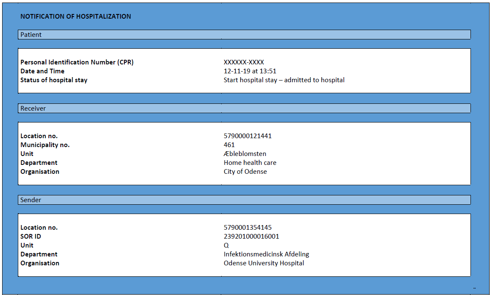

[Return](../../index.md)
# Clinical Guidelines 

**Table of Content**
* [1 Introduction](#1-introduction)
* [2 Purpose](#2-purpose)
* [3 Background](#3-background)
* [4 Legal framework](#4-legal-framework)
* [5 &#39;HospitalNotification&#39;: requirements for content and benefits](#5-&#39;hospital-notification&#39;-:-requirements-for-content-and-benefits)
* [6 Business rules for use of &#39;HospitalNotification&#39;](#6-Business-rules-for-use-of-&#39;HospitalNotification&#39;)
  * [6.1 Use cases](#7-Use-cases)
  * [6.2 Technical specifications for &#39;HospitalNotification&#39;](#8-Technical-specifications-for-&#39;Hospital-Notification&#39;)
  * [6.3 Example of a HospitalNotification](#9-Example-of-a-HospitalNotification)
<!-- * [7 Release Notes](#7-release-notes) -->

# 1 Introduction

This is the textual part of the documentation for MedCom&#39;s FHIR-standard &#39;HospitalNotification&#39;. It includes purpose, background and overall requirements for content and business-related use of &#39;HospitalNotification&#39;.The target group is IT-system vendors and those responsible for implementation in the regions and municipalities, who will technically support the sending and receiving of &#39;HospitalNotification&#39;.The requirements for content and business-related use of &#39;HospitalNotification&#39;are prepared in collaboration with MedCom&#39;s &#39;homecare-hospital group&#39;<a href="https://www.medcom.dk/opslag/navne-og-adresser?gruppe=Hjemmepleje-sygehusgruppe" target="_blank">hjemmepleje-sygehusgruppe</a> og <a href="https://www.medcom.dk/opslag/navne-og-adresser?gruppe=Kommune-Sygehusleverand%C3%B8rgruppen" target="_blank">kommune-sygehusleverandørgruppe</a> in the MedCom11 project period 2018-2019. The &#39;HospitalNotification&#39; replaces the previous MedCom standards, Notification of Admission <a href="https://svn.medcom.dk/svn/releases/Standarder/Det%20gode%20kommuneadvis/EDI/Dokumentation/" target="_blank">DIS20 </a> / <a href="https://svn.medcom.dk/svn/releases/Standarder/Det%20gode%20kommuneadvis/XDIS20/Dokumentation/" target="_blank">XDIS20</a>, and Notification of Discharge <a href="https://svn.medcom.dk/svn/releases/Standarder/Det%20gode%20kommuneadvis/EDI/Dokumentation/" target="_blank">DIS17</a> / <a href="https://svn.medcom.dk/svn/releases/Standarder/Det%20gode%20kommuneadvis/XDIS17/Dokumentation/" target="_blank">XDIS17</a>. The technical specifications for the FHIR notification standard can be found on [the front page for HospitalNotification](../../index.md). This document is also available in Danish. 

  >Note: In case of any discrepancies between the two documents, the Danish document is the document in force.  

# 2 Purpose

The &#39;HospitalNotification&#39; contributes to securing the foundation for a coherent clinical pathway across sectors. The specific purpose of the &#39;HospitalNotification&#39; is to inform the citizen&#39;s current care and health provider in the primary sector about the start and end of the citizen&#39;s stay at the hospital. It makes it possible to pause the current care and health providers&#39; services during the hospital stay and resume them when it ends. At the same time, the &#39;HospitalNotification&#39; can trigger the automatic sending of Report of Admission (<a href="https://svn.medcom.dk/svn/releases/Standarder/National%20Sygehus-Kommunesamarbejde/1.0.3/XDIS16/Dokumentation/" target="_blank">XDIS16</a>) from the receiver&#39;s system, which gives the health professionals an overview of the citizen&#39;s current services, level of function and health related problems. The HospitalNotification also contains notification of the patient&#39;s leave from the hospital stay and acute ambulant care.

# 3 Background

As the hospital is not able to determine in advance which citizens currently receive services from the primary sector, a &#39;HospitalNotification&#39; is generated for all citizens with a personal identification number (CPR) and home address in Denmark when registered in the hospital&#39;s EPR system. The receiving system ensures that the &#39;HospitalNotification&#39; stay is only downloaded and shown for citizens receiving services within the valid legal framework (see Section [Legal framework](#-Legal-framework)).

Registration of hospital stays in the EPR system are linked to the reporting to the National Patient Registry, LPR. By transition to LPR3 (2019), the concepts &#39;admitted&#39; and &#39;outpatient&#39; are removed in the reporting to LPR and replaced by physical attendance. In practice, all regions continue to register the hospital stay as outpatient and admission, respectively. It is agreed among the parties behind the development of the modernisedhospitalnotification that the scope of the hospital stays, which will be supported by a notification, is:

&quot;_All current hospital stays with physical attendance by the patient and all planned hospital stays with physical attendance by the patient for the purpose of admission.&quot;

# 4 Legal framework

Notifications of hospital stay are exchanged on the basis of the Danish Health Act and Danish Legal Protection Act §12c:

&quot;_For use in the planning of care services etc pursuant to § 79 a, chapter 16 and §§ 107 and 108 in the social services and health care act as well as for follow-ups of cases pursuant to §§ 8-10 in the act on sickness benefits, the municipal council and hospital can exchange information about citizens admission and discharge from hospitals within the municipality and about the citizen&#39;s acute hospital stay, where the citizen stays at the hospital for assessment and treatment without being admitted. The exchange can take place automatic and without the consent of the citizen.&quot; (Danish Legal Act 12c LBK 265 25/02/2022)

The service act §79 a includes *preventive home visits*, chapter 16 includes §§ 83-99, which covers *personal help, care and nursing as well as care wills,* and §§ 107 and 108 covers *temporary and long-term sheltered residence.*

# 5 &#39;HospitalNotification&#39;: requirements for content and benefits &#39;HospitalNotification&#39; must include:

1. The patient&#39;s personal identification number (CPR)
2. Time and date for start/end of the hospital stay
3. Name of the hospital department/ward and hospital
4. Specification if the notification should trigger an admission report from the receiver of the notification
5. Specification of where the admission report should be sent
6. Status of hospital stay (cf. Table 1).
 
&nbsp;

>Note:Danish code names, which can be related to overview of notification codes and HL7 FHIR resources.  

<table class="tg">
<caption style="color:#2c415c;
  font-weight:bold"> Table 1: Status of hospital stay</caption>
<thead>
  <tr>
    <th class="tg-pu9k">Event</th>
    <th class="tg-pu9k">Code *</th>
    <th class="tg-pu9k">Name of notification</th>
    <th class="tg-pu9k">Benefits</th>
  </tr>
</thead>
<tbody>
  <tr>
    <td class="tg-vfn1" colspan="3">Start stay</td>
    <td class="tg-vfn1"></td>
  </tr>
  <tr>
    <td class="tg-tysj">Acute ambulant care start</td>
    <td class="tg-tysj">STAA</td>
    <td class="tg-tysj">START hospital stay – Acute ambulant care</td>
    <td class="tg-tysj">The receiver is informed that the citizen is registered as ‘acute ambulant’ at the hospital. The specific status allows the receiving system to set rules for the system management.</td>
  </tr>
  <tr>
    <td class="tg-tysj">Admitted to hospital</td>
    <td class="tg-tysj">STIN</td>
    <td class="tg-tysj">START hospital stay – admission</td>
    <td class="tg-tysj">The receiver is informed that the citizen is registered as ‘admitted to hospital’. The specific status allows the receiving system to set rules for the system management.</td>
  </tr>
  <tr>
    <td class="tg-vfn1" colspan="3">End stay</td>
    <td class="tg-vfn1"></td>
  </tr>
  <tr>
    <td class="tg-tysj">Patient discharged and sent home</td>
    <td class="tg-tysj">SLHJ</td>
    <td class="tg-tysj">END hospital stay – patient discharged and sent home/to primary sector</td>
    <td class="tg-tysj">The receiver is informed that the citizen’s hospital stay is ended and is transferred to either home or primary sector. It allows the receiving system to set rules for the system management, for example resuming care services. Not used for transfer.</td>
  </tr>
  <tr>
    <td class="tg-vfn1" colspan="3">Death</td>
    <td class="tg-vfn1"></td>
  </tr>
  <tr>
    <td class="tg-tysj">The patient is dead</td>
    <td class="tg-tysj">MORS</td>
    <td class="tg-tysj">DEATH</td>
    <td class="tg-tysj">The receiver is informed that the citizen is dead. Used both if dead at arrival and dead during the hospital stay.</td>
  </tr>
  <tr>
    <td class="tg-vfn1" colspan="3">Leave</td>
    <td class="tg-vfn1"></td>
  </tr>
  <tr>
    <td class="tg-tysj">The patient starts leave</td>
    <td class="tg-tysj">STOR</td>
    <td class="tg-tysj">START leave</td>
    <td class="tg-tysj" rowspan="2">Information about current leave is useful when/if relatives/the citizen reaches out during the leave. The treatment responsibility for the patient on leave lies at the hospital and must be communicated separately if actors other than the hospital delivers care services during the patient’s leave.</td>
  </tr>
  <tr>
    <td class="tg-tysj">The patient ends leave</td>
    <td class="tg-tysj">SLOR</td>
    <td class="tg-tysj">END leave</td>
  </tr>
  <tr>
    <td class="tg-vfn1" colspan="3">Cancellations</td>
    <td class="tg-vfn1"></td>
  </tr>
  <tr>
    <td class="tg-tysj">Cancellation</td>
    <td class="tg-tysj">ANXX</td>
    <td class="tg-tysj">CANCELLED ‘Name of notification’</td>
    <td class="tg-tysj">Cancellation of previously sent notifications. Is used in case of wrong choice of hospital stay or wrong personal identification number (CPR).</td>
  </tr>
  <tr>
    <td class="tg-vfn1" colspan="3">Corrections</td>
    <td class="tg-vfn1"></td>
  </tr>
  <tr>
    <td class="tg-tysj">Corrections</td>
    <td class="tg-tysj">REXX</td>
    <td class="tg-tysj">CORRECTED 'Name of electronic notification’</td>
    <td class="tg-tysj">Corrects content in previously sent notifications, for example hospital department or time.</td>
  </tr>
</tbody>
</table>
*represents [danish codes names described in the overview of HospitalNotification codes](https://medcomdk.github.io/dk-medcom-hospitalnotification/assets/documents/Overview-HospitalNotification-codes-FHIR.html)

# 6 Business rules for use of &#39;HospitalNotification&#39;

The purpose of the outlined business rules for use of the &#39;HospitalNotification&#39; is that the actors who use the notification, use the messages as intended. Business rules are a supplement to the standard for &#39;HospitalNotification&#39; and can be updated as the needs change.

  >Note:Private hospitals can also use hospitalnotifications

1. **Electronic notifications are generated based on real-time registration in the EPR/PAS system**If EPR/PAS uses future registrations of planned contacts, these should trigger the electronic notification only when the time occurs, i.e. at the patient&#39;s physical attendance.

2. **Ended hospital stay (admission and acute ambulant care) is only used when the patient is discharged (and sent home/to primary sector)**Notification of &#39;ENDED hospital stay&#39; cannot be used in case of transfer.

    >Note:f the patient is responsible for transport from hospital A to hospital B him-/herself, END hospital stay can be used. The planned transfer should be communicated to the receiver in the care process plan or in a correspondence message.

3. **If an acute ambulant stay is changed to the patient being admitted, a new &#39;START hospital stay – admission&#39; notification is sent.** No notification on &#39;ENDED hospital stay&#39; should be sent when the acute ambulant stay changes to the patient being admitted. Notification on &#39;ENDED hospital stay&#39; is sent when the patient is subsequently discharged (sent home/to primary sector).

4. **If an admission changes to acute ambulant care, a new &#39;START hospital stay – acute ambulant care&#39; notification is sent.** No notification on &#39;ENDED hospital stay&#39; should be sent when the admission changes to acute ambulant care. Notification on &#39;ENDED hospital stay&#39; is sent when the patient is subsequently discharged (sent home/to primary sector). This occurrence is seen as rare.

5. **If the patient is declared dead on arrival, after arrival or during the hospital stay, the notification of the type &#39;DEATH&#39; is sent.**
The notification type &#39;DEAD&#39; should be used in all cases where the patient is dead or dies.

6. **If the patient is registered as on leave in the EPR, the notification is sent when the patient starts (&#39;START leave&#39;) or finishes (&#39;END leave&#39;) their leave (at home).** Leave notifications is only sent when the patient is registered as being on leave at home. In case of a double admission,leave should therefore not trigger a leave notification. Leave notifications should not activate care services in the municipality unless otherwise agreed.

   >Note:Admission in psychiatric and somatic departments at the same time.

7. **If an incorrect registration has happened, which has caused an incorrect electronic notification, a correction or cancellation must be sent on the following principles:**
    1. If a notification has been sent because of wrongly entered personal identification number (CPR) or wrong choice of hospital stay, **a cancellation** is sent.
    2. If a notification with the wrongly stated hospital department or time of stay is sent, **a correction** is sent, i.e. a new correct notification that replaces previous notifications. A cancellation is not sent prior to the correction.

8. **No specific transfer notification is used.** A requirement is made that new notifications with &#39;START hospital stay&#39; is sent from the hospital, which the patient is transferred **to**, either if it is in the same region or another region. No notification is sent from the hospital, which the patient is transferred form. 

   >Note: If the patient is responsible for transport from hospital A to hospital B him-/herself, END hospital stay can be used. The planned transfer should be communicated to the receiver in the care process plan or in a correspondence message.

9. **Discharge to hospice**
Same flow as for transfer to another hospital in the same or another region is used. Hospice sends &#39;START hospital stay – admission&#39; when the patient arrives.

&nbsp;

## 6.1 Use cases
For use of the technical implementation of the &#39;HospitalNotification&#39;, use case descriptions in more details exist. They connect content requirements with the business-related use for sender and receiver of the HospitalNotification. The use cases can be found on [the front page for HospitalNotification](../../index.md).

## 6.2 Technical specifications for &#39;HospitalNotification&#39;
The FHIR profile for hospitalnotification can be found  on [the front page for HospitalNotification](../../index.md).

## 6.3 Example of a HospitalNotification

<figure>

<figcaption text-align = "center"><b>Figur 1: Example of a HospitalNotification</b></figcaption>
</figure>
 

>Note This is an example of what the HospitalNotification could look like. In the notification, the &#39;status on hospital stay&#39; will indicate which event has caused the electronic notification.

<!-- # 7 Release Notes 
[The latest changes of this page](../documents/ReleaseNotesClinGuideENG.md) can be found here. -->