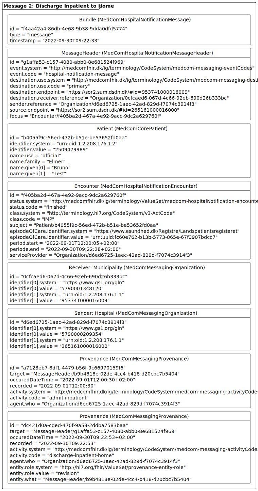
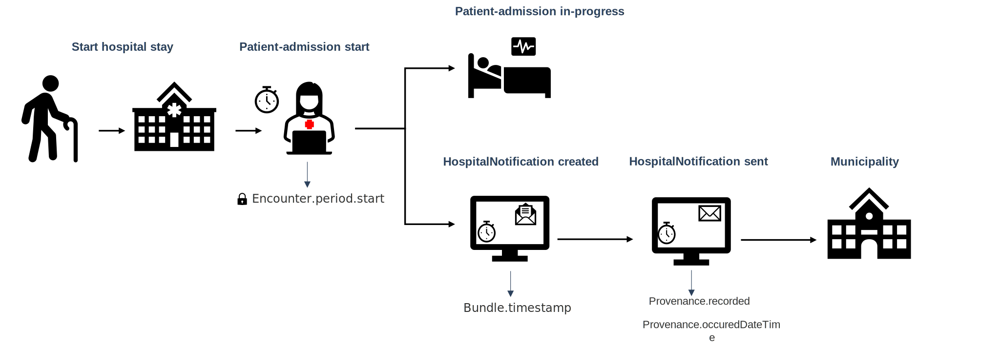
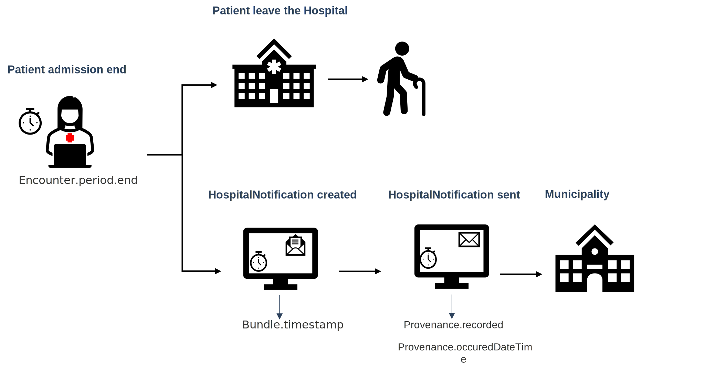
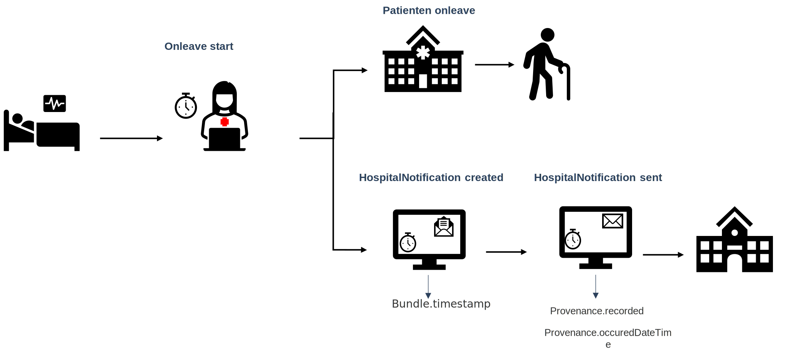
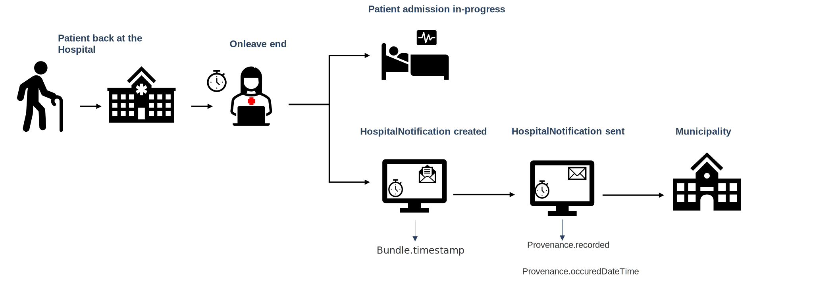

[Return](../../index.md)
# Introduction to the technical specification

**Table of contents**
* [1 Profiles in the HospitalNotification Standard](#1-profiles-in-the-hospitalnotification-standard)
  * [1.1 Service Provider](#11-serviceprovider)
  * [1.2 Report of admission](#12-report-of-admission)
* [2 Internal Reference in a HospitalNotification Message](#2-internal-references-in-a-hospitalnotification-message)
* [3 Examples in a HospitalNotification Message](#3-examples-in-a-hospitalnotification-message) 
* [4 Timestamps in HospitalNotification message](#4-timestamps-in-hospitalnotification-message)
  * [4.1 Scenario 1-Patient admission starts](#41-scenario-1---patient-admission-starts)
  * [4.2 Scenario 2-Patient admission ends](#42-scenario-2---patient-admission-ends)
  * [4.3 Scenario 3-Patient leave starts](#43-scenario-3---patient-leave-starts)
  * [4.4 Scenario 4-Patient leave ends](#44-scenario-4---patient-leave-ends)
<!-- * [4 Release Notes](#4-release-notes) -->
  
  >Note: In case of discrepancies between the <a href="https://medcomfhir.dk/ig/medcomdk/dk-medcom-hospitalnotification/" target="_blank">MedCom HospitalNotification Implementation Guide (IG)</a> and this page, it is the IG which should be followed. Please contact <fhir@medcom.dk> if you find discrepancies.
 

## 1 Profiles in the HospitalNotification Standard

In total, seven profiles from <a href="https://medcomfhir.dk/ig/medcomdk/dk-medcom-core/" target="_blank">MedCom Core IG</a>, <a href="https://medcomfhir.dk/ig/medcomdk/dk-medcom-messaging/" target="_blank">MedCom Messaging IG</a> and <a href="https://medcomfhir.dk/ig/medcomdk/dk-medcom-hospitalnotification/" target="_blank">MedCom HospitalNotification IG</a> constitute the HospitalNotification standard. A short description of each profile can be seen in the <a href="#tab1">Table 1<a>.
  

<table class="tg" id="tab1">
<caption style="color:#2c415c; font-weight:bold; text-align:center"> Table 1: Overview of the profiles in HospitalNotification standard </caption>
<thead>
  <tr>
    <th class="tg-4mz0">Profile</th>
    <th class="tg-4mz0">Resource</th>
    <th class="tg-4mz0">Description</th>
    <th class="tg-4mz0">MustSupport elements</th>
    <th class="tg-4mz0">Implementation Guide Origin</th>
  </tr>
</thead>
<tbody>
  <tr>
    <td class="tg-7euo"><a href="https://medcomfhir.dk/ig/dk-medcom-hospitalnotification/StructureDefinition-medcom-hospitalNotification-message.html" target="_blank">MedComHospitalNotificationMessage</a></td>
    <td class="tg-7euo">Bundle</td>
    <td class="tg-7euo">Acts as a container for the content of the message. The type of the Bundle shall always be 'message'.  This profile inherits from MedComMessagingMessage.</td>
    <td class="tg-7euo">Id Type Timestamp  Entry</td>
    <td class="tg-7euo">HospitalNotification</td>
  </tr>
  <tr>
    <td class="tg-7euo"><a href="https://medcomfhir.dk/ig/dk-medcom-hospitalnotification/StructureDefinition-medcom-hospitalNotification-messageHeader.html" target="_blank">MedComHospitalNotificationMessageHeader</a></td>
    <td class="tg-7euo">MessageHeader</td>
    <td class="tg-7euo">The header of a message, which shall always be the first referenced profile, when the type of the Bundle is 'message'. This profile holds references to the fundamental information in a message such as sender, receiver, the content of the message and request for report of admission.  This profile inherits from MedComMessagingMessageHeader.</td>
    <td class="tg-7euo">Id ReportOfAdmissionFlag  ReportOfAdmissionRecipient  Event[x]:eventCoding  Sender Organization Receiver Organization Source (Receiver of the Acknowledgement) Focus</td>
    <td class="tg-7euo">HospitalNotification</td>
  </tr>
  <tr>
    <td class="tg-7euo"><a href="https://medcomfhir.dk/ig/dk-medcom-hospitalnotification/StructureDefinition-medcom-hospitalNotification-encounter.html" target="_blank">MedComHospitalNotificationEncounter</a></td>
    <td class="tg-7euo">Encounter</td>
    <td class="tg-7euo">A meeting between a healthcare professional and a patient. In a HospitalNotification message the start time of the encounter represents the hospitalization of the patient.  This profile inherits from MedComCoreEncounter</td>
    <td class="tg-7euo">Id Status  class Subject  EpisodeOfCare identifier Period start (start time of the encounter) Period end (end time of the encounter) ServiceProvider organization</td>
    <td class="tg-7euo">HospitalNotification</td>
  </tr>
  <tr>
    <td class="tg-7euo"><a href="https://medcomfhir.dk/ig/dk-medcom-core/StructureDefinition-medcom-core-patient.html" target="_blank">MedComCorePatient</a></td>
    <td class="tg-7euo">Patient</td>
    <td class="tg-7euo">Describes a citizen or patient, when exchanging a MedCom message.</td>
    <td class="tg-7euo">Id identifier (CPR-number) Name Address Telecom Deceased[x]</td>
    <td class="tg-7euo">Core</td>
  </tr>
  <tr>
    <td class="tg-7euo"><a href="https://medcomfhir.dk/ig/dk-medcom-core/StructureDefinition-medcom-core-organization.html" target="_blank">MedComCoreOrganization</a></td>
    <td class="tg-7euo">Organization</td>
    <td class="tg-7euo">Contains information which is useful in order to identify an organization. In a HospitalNotification message it is often used to describe the serviceProvider organization or department.</td>
    <td class="tg-7euo">Id Identifier (SOR-id) Name</td>
    <td class="tg-7euo">Core</td>
  </tr>
  <tr>
    <td class="tg-7euo"><a href="https://medcomfhir.dk/ig/dk-medcom-messaging/StructureDefinition-medcom-messaging-organization.html" target="_blank">MedComMessagingOrganization</a></td>
    <td class="tg-7euo">Organization</td>
    <td class="tg-7euo">Contains information which is useful in order to identify a sender or receiver organization. This profile inherits from MedComCoreOrganization.</td>
    <td class="tg-7euo">Id Slices for identifier (SOR-id) Slices for identifier (EAN/GLN-id) Name</td>
    <td class="tg-7euo">Messaging</td>
  </tr>
  <tr>
    <td class="tg-7euo"><a href="https://medcomfhir.dk/ig/dk-medcom-messaging/StructureDefinition-medcom-messaging-provenance.html" target="_blank">MedComMessagingProvenance</a></td>
    <td class="tg-7euo">Provenance</td>
    <td class="tg-7euo">Describes the activity of a message, e.g. whether the message concern an inpatient admission or discharge. In cases of a previously send message concerning the same admission, the Provenance resource holds a reference to the previous message. Thereby it is possible to get an overview of the patient's admission.</td>
    <td class="tg-7euo">Id Target OccurredDateTime Timestamps Activity Agent Entity (Reference to the previous message)</td>
    <td class="tg-7euo">Messaging</td>
  </tr>
</tbody>
</table>

  

### 1.1 ServiceProvider and Sender
The serviceProvider is the organization or department in charge of the patients admission, whereas the sender is the organization or deprtment responsible for sending the HospitalNotification message. 
The sender of a HospitalNotification and the serviceProvider may be the same hospital department, hence be represented referencing the same instance of a Organization resource, which in this case shall be a MedComMessagingOrganization. However, the sender organisation may be a higher-level deparment (in the SOR-register) than the serviceProvider, and in this case they shall be represented referencing two different instances of a Organization resource.

### 1.2  Report of admission
The request for a report of admission must be sent when a patient is initially admitted, meaning that the type of HospitalNotification is STIN og STAA. In these cases, the Provenance.activity.code is admit-inpatient or admit-emergency, respectively. A request for a report of admission shall not be send when the patient returns from leave (SLOR) or is relocated from another hospital. 

On page 10 in the use case document the usage of the report of admission flag is further described. <a href="https://medcomdk.github.io/dk-medcom-hospitalnotification/#12-use-cases">Click here to finde the use cases</a>. 

## 2 Internal References in a HospitalNotification Message
The HospitalNotification message follows <a href="https://medcomdk.github.io/dk-medcom-messaging/assets/documents/Intro-Technical-Spec-ENG.html" target="_blank">MedCom's generic messaging model</a>. 

The references between the profiles are shown in  <a href="#Fig1" rel="noopener noreferrer"> Figure 1 </a> below. The MedComHospitalNotificationMessage profile acts as the container which includes the other profiles. From the MedComHospitalNotificatiomMessageHeader are the sender, receiver and carbon-copy organization referenced as the MedComMessagingOrganization together with the focus of the message, which is the MedComHospitalNotificationEncounter profile. This encounter must always reference a subject of the type MedComCorePatient. Additionally, the patient's service provider organization is also referenced from the encounter.  
MedComMessagingProvenance is used to keep track of the messaging history and define the activity of the notification. The provenance both references the MedComMessagingMessageHeader as the target and the actor in terms of a MedComMessagingOrganisation. 

<figure>

<figcaption text-align="center"><b>Figure 1: Structure of the HospitalNotification message </b> </figcaption>
</figure>
  

## 3 Examples in a HospitalNotification Message
In the <a href="#Fig2" rel="noopener noreferrer"> Figure 2 </a> and <a href="#Fig3" rel="noopener noreferrer"> Figure 3 </a>, the required content of a HospitalNotification message is illustrated. 
There is a difference between the required elements and MustSupport elements, as the required element always shall be included in a message. MustSupport elements must be included if they are present in the sender's system and the receiver must be able to handle the information if it is included. Thus, there is a discrepancy between the elements mentioned in the table above and <a href="#Fig2" rel="noopener noreferrer"> Figure 2 </a> and <a href="#Fig3" rel="noopener noreferrer"> Figure 3 </a>  . 
More examples for HospitalNotification in both XML and JSON format can be found on  MedComHospitalNotificationMessage profile. 
<a href="https://medcomfhir.dk/ig/dk-medcom-hospitalnotification/StructureDefinition-medcom-hospitalNotification-message-examples.html" target="_blank">Click here to see examples for MedCom HospitalNotificationMessage </a>
The message in <a href="#Fig2" rel="noopener noreferrer"> Figure 2 </a> and in <a href="#Fig3" rel="noopener noreferrer"> Figure 3 </a> illustrate an admission and discharge of a patient, respectively. In the two messages the serviceProvider and sender organization are represented with the same instance. The patient, serviceProvider organization, sender and receiver information are identical since both messages are sent from a hospital to a municipality.

In 'Message 2: Discharge Inpatient to Home'(in <a href="#Fig3" rel="noopener noreferrer"> Figure 3 </a>) there are two MedComMessagingProvenances, as all provenance instances in a stream of messages must be included, as it constitutes a messaging history. 
 
  > Note: IT vendors cannot assume any specific order of the resources in a message. 

<figure>

<figcaption text-align = "center"><b>Figure 2: Simplified example: Admit Inpatient </b></figcaption>
</figure>

<figure>

<figcaption text-align = "center"><b>Figure 3: Simplified example: Discharge  Inpatient </b></figcaption>
</figure>
  

## 4 Timestamps occured in HospitalNotification message

The HospitalNotification message contains five timestamps:

* Encounter.period.start
* Encounter.period.end
* Bundle.timestamp
* Provenance.occuredDateTime[x]
* Provenance.recorded.
 

The five timestamps are registered at different times during the patient's hospital stay.

### 4.1 Scenario 1 - Patient admission starts
E.i. during patient admission, the timestamps are registered in the following way (see <a href="#Fig4">Figure 4</a>):

When the patient arrives at the hospital, the hospital staff admits the patient and the first timestamp, Encounter.period.start,  is registered. Please notice that the Encounter.period.start does not change during the citizen's hospital stay.

Immediately after the hospital staff admits the patient to the hospital, the HospitalNotification for admission is generated and Bundle.timestamp is registered. When the HospitalNotification is sent to the municipality the Provenance.occuredDateTime[x] and Provenance.recorded timestamp are registered. Note that the Provenance.occuredDateTime[x] is a human readable, where Provenance.recorded is a system readable timestamp.

<figure>

<figcaption text-align = "center"><b>Figure 4: Timestamps registration  in HospitalNotfication for Patient admission start </b></figcaption>
</figure> 

### 4.2 Scenario 2 - Patient admission ends
When the patient is ready to be discharged from the hospital, the hospital staff completes the discharge form and the Encounter.period.end is registered. Immediately after the hospital staff completed the discharge form, a HospitalNotification for discharge is generated and the Bundle.timestamp for the discharge HospitalNotification is registered. When the discharge HospitalNotification is sent to the Provenance.occuredDateTime[x] and Provenance.recorded timestamp are registered. Note that the Provenance.occuredDateTime[x] is a human readable, where Provenance.recorded is a system readable timestamp.

The process of timestamps registration when patient's admission ends is visualised in <a href="#Fig5"> Figure 5</a>.

<figure>

<figcaption text-align = "center"><b>Figure 5: Timestamps registration in HospitalNotification for Patient admission end. </b></figcaption>
</figure> 

### 4.3 Scenario 3 - Patient leave starts
In case of that, the patient takes leave from the hospital admission the hospital staff register leave in the system (see <a href="#Fig5"> Figure 6</a>).Immediately after the hospital staff has registered the patient's leave, the HospitalNotification for onleave is generated and Bundle.timestamp is registered. When the HospitalNotification is sent to the municipality the Provenance.occuredDateTime[x] and Provenance.recorded timestamp are registered. Note that the Provenance.occuredDateTime[x] is a human-readable, where Provenance.recorded is a system readable timestamp. 

<figure>

<figcaption text-align = "center"><b>Figure 6: Timestamps registration in HospitalNotification for onleave start. </b></figcaption>
</figure> 

### 4.4 Scenario 4 - Patient leave ends
When the patient returns to the hospital from his leave,the hospital staff register the return and the patient continues his admission (see <a href="#Fig7"> Figure 7</a>). Immediately after the hospital staff has registered the patient's leave, the HospitalNotification for onleav is generated and Bundle.timestamp is registered. When the HospitalNotification is sent to the municipality the Provenance.occuredDateTime[x] and Provenance.recorded timestamp are registered. Note that the Provenance.occuredDateTime[x] is a human-readable, where Provenance.recorded is a system readable timestamp. 
Please notice that the Encounter.period.start stays unchanged when the patient takes leave and the Encounter.period.end is not registered. The Encounter.period.end is ONLY registered when the patient ends the admission. 
<figure>

<figcaption text-align = "center"><b>Figure 7: Timestamps registration in HospitalNotification for onleave end. </b></figcaption>
</figure> 

  
<!--  -->

<!-- ## 4 Release Notes 
[The latest changes of this page](../documents/ReleaseNoteIntroTechnicalSpec.md) can be found here. -->

