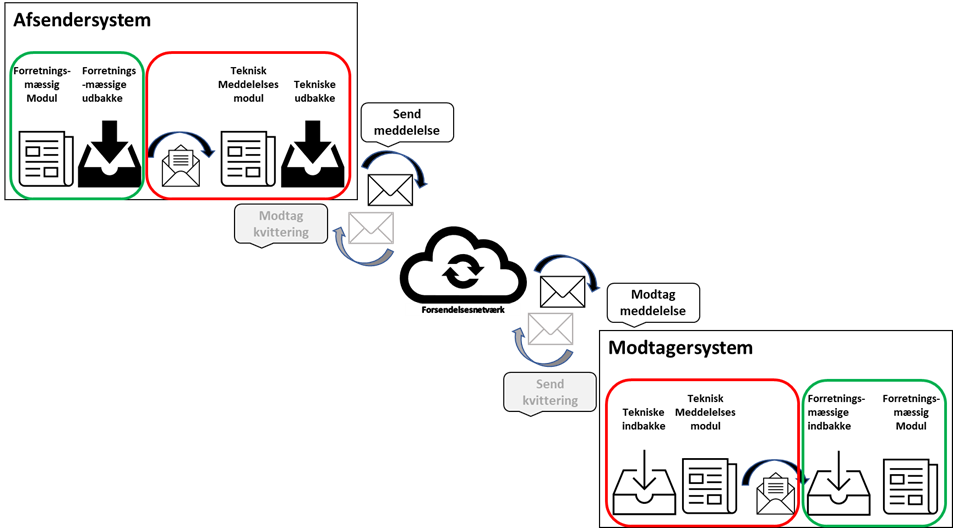

[Tilbage](../../index.md)

# Use cases for advis om sygehusophold

**Tabel of content**

* [1 Indledning ](#indledning)
  * [1.1 Baggrund og formål ](#baggrund-og-formål)
  * [1.2 Juridisk grundlag ](#juridisk-grundlag)
  * [1.3 Målgruppe ](#målgruppe)
  * [1.4 Referencer ](#referencer)
  * [1.5 Termer ](#termer)
  * [1.6 Afgrænsning ](#afgrænsning)
  * [1.7 Læsevejledning ](#_Toc104888739)
  * [2 Oversigt over use cases ](#oversigt-over-use-cases)
* [2.1 Oversigt over primære og alternative use cases ](#oversigt-over-primære-og-alternative-use-cases)
  * [2.2 Korrigerende use cases ](#korrigerende-use-cases)
  * [2.3 Teknisk validering af lovhjemmel til modtagelse ](#teknisk-validering-af-lovhjemmel-til-modtagelse)
* [3 Use cases](#use-cases)
  * [3.1 S1: Indlæg patient og send advis](#s1-indlæg-patient-og-send-advis)
    * [3.1.1 S1.A1: Indlæg patient og send advis\[STIN\] uden anmodning om indlæggelsesrapport ](#S1.A1-indlæg-patient-og-send-advis-udenom-anmodning-om-indlæggelsesrapport)
    * [3.1.2 S1.A2: Indlæg patient uden afsendelse af advis\[STIN\] ](#S1.A2-Indlæg-patient-uden-afsendelse-af-advis)
  * [3.2 R1: Modtag advisering om indlæggelse og send indlæggelsesrapport](#r1-modtag-advisering-om-indlæggelse-og-send-indlæggelsesrapport)
    * [3.2.2 R1.A1: Modtag advisering om indlæggelse uden afsendelse af indlæggelsesrapport](#r1.a1-modtag-advisering-om-indlæggelse-uden-afsendelse-af-indlæggelsesrapport)
* [4 Korrigerende use cases](#korrigerende-use-cases-1)
  * [4.1 S.CANC: Annullér et allerede udsendt advis](#s.canc-annullér-et-allerede-udsendt-advis)
  * [4.2 R.CANC: Modtag advisering om annulleret advis](#r.canc-modtag-advisering-om-annulleret-advis)
  * [4.3 S.CORR: Ret sygehusophold og send rettelsesadvis](#s.corr-ret-sygehusophold-og-send-rettelsesadvis)
  * [4.4 R.CORR: Modtag advisering om rettet advis](#r.corr-modtag-advisering-om-rettet-advis)
* [5 Teknisk validering af lovhjemmel til modtagelse](#teknisk-validering-af-lovhjemmel-til-modtagelse-1)
  * [5.1 R.PC: Modtag og indlæs advis (teknisk)](#r.pc-modtag-og-indlæs-advis-teknisk)
    * [5.1.1 R.PC.A1 Modtag og kassér advis (teknisk)](#r.pc.a1-modtag-og-kassér-advis-teknisk)
* [6 Regler for systemerne, som use casene beror på](#regler-for-systemerne-som-use-casene-beror-på)
  * [6.1 Regler for afsendersystemet, som use casene beror på](#regler-for-afsendersystemet-som-use-casene-beror-på)
    * [6.1.1 Regler vedr. afsendelse af forskellige typer af sygehusadviser](#regler-vedr.-afsendelse-af-forskellige-typer-af-sygehusadviser)
    * [6.1.2 Øvrige regler vedr. forsendelse af HospitalNotification](#øvrige-regler-vedr.-forsendelse-af-hospitalnotification)
* [6.2 Regler for modtagersystemet, som use casene beror på](#regler-for-modtagersystemet-som-use-casene-beror-på)
  * [6.2.1 Regler vedr. modtagelse af HospitalNotification](#regler-vedr.-modtagelse-af-hospitalnotification)

# Introduktion

Dette dokument indeholder en række use case-beskrivelser og udgør en del af det samlede dokumentationsmateriale for MedComs FHIR-standard ”Advis om sygehusophold”.

Dokumentationen består af 3 dele og kan findes på [forsiden for advis om sygehusophold](../../index.md).
1. ’Advis om sygehusophold’ - Sundhedsfaglige retningslinjer
2. Implementation Guide for ’HospitalNotification’
3. Use cases (nærværende dokument – findes også på engelsk)

&nbsp;

  > Note: I tilfælde af uoverensstemmelser mellem det danske og det engelske dokument, er det danske dokument det gældende dokument

Use case-beskrivelserne supplerer det øvrige dokumentationsmateriale og
bør derfor læses i sammenhæng til dette [se afsnit 1.4 Referencer](#s.canc-annullér-et-allerede-udsendt-advis).

## Baggrund og formål
Use casene forbinder krav til indhold med forretningsregler for anvendelse og skal sikre en ensartet implementering og anvendelse af ”Advis om sygehusophold”. Use casene er kvalificeret i samarbejde med EPJ- og kommuneleverandører.

Use casene er udarbejdet og kvalificeret i samarbejde med repræsentanter
fra regioner og kommuner gennem MedComs hjemmepleje-sygehusgruppe, samt
relevante systemleverandører

## Målgruppe
Use case beskrivelserne er målrettet it-systemleverandørerne og de implementeringsansvarlige i regioner og kommuner.

## Juridisk grundlag

Adviser om sygehusophold udveksles med baggrund i Sundhedsloven og
Retssikkerhedslovens § 12 c

*"Til brug for tilrettelæggelsen af omsorgsopgaver mv. efter § 79 a og
kapitel 16 og §§ 107 og 108 i lov om social service og Sundhedsloven
samt til brug for opfølgning af sager efter §§ 8-10 i Lov om
sygedagpenge kan kommunalbestyrelser og sygehuse udveksle oplysninger om
indlæggelse på og udskrivning fra sygehuse af borgere i kommunen og om
borgerens akutte sygehusophold, hvor borgeren opholder sig på sygehuset
til vurdering og behandling uden at være indlagt. Udvekslingen kan ske
automatisk og uden borgerens samtykke" (Retssikkerhedsloven § 12 c LBK
nr. 265 af 25/02/2022).*

Servicelovens § 79 a omfatter forebyggende hjemmebesøg, kapitel 16
indeholder §§ 83-99, som omfatter personlig hjælp, omsorg og pleje samt
plejetestamenter, og §§ 107 og 108 omfatter midlertidige og
længerevarende botilbud

## Referencer 

<table class="tg">
<caption style="color:#2c415c;font-weight:bold; text-align:center"> Tabel 1: Oversigt over relevante refenrencer til use casene </caption>
<thead id="#Tb1">
  <tr>
    <th class="tg-pu9k">    Materiale   </th>
    <th class="tg-pu9k">    Version   </th>
    <th class="tg-pu9k">    Link/reference   </th>
    <th class="tg-pu9k">    Beskrivelse   </th>
  </tr>
</thead>
<tbody>
  <tr>
    <td class="tg-tysj">    SKA-4.X.X Forretningsmæssige use cases   </td>
    <td class="tg-tysj">    1.0.0-rc.1   </td>
    <td class="tg-tysj">    LINK   </td>
    <td class="tg-tysj">    Skabelon, som disse use cases er udarbejdet på baggrund af   </td>
  </tr>
  <tr>
    <td class="tg-tysj">    Generelle tekniske   use cases   </td>
    <td class="tg-tysj">    1.0.0-rc.1   </td>
    <td class="tg-tysj">    LINK   </td>
    <td class="tg-tysj">    Detaljerede use case-beskrivelser af de tekniske handlinger, der sker   før og efter brugeraktørens interaktion i systemet, herunder kommunikationen   med kommunikationsnetværket vedr. afsendelse og modtagelse af meddelelser og   kvitteringer.   </td>
  </tr>
  <tr>
    <td class="tg-tysj">    Sundhedsfaglige og tekniske behov    </td>
    <td class="tg-tysj">    1.0.0   </td>
    <td class="tg-tysj">    LINK   </td>
    <td class="tg-tysj">    Samlet overblik over de sundhedsfaglige og tekniske behov, som   standarden skal opfylde og use casene afspejle.   </td>
  </tr>
</tbody>
</table>

## Termer

<table class="tg">
<caption style="color:#2c415c; font-weight:bold;text-align:center"> Tabel 2: Oversigt over termer brugt i use casene  </caption>
<thead id="#Tb2">
  <tr>
    <th class="tg-pu9k">Termer</th>
    <th class="tg-pu9k">Beskrivelse</th>
  </tr>
</thead>
<tbody>
  <tr>
    <td class="tg-tysj">Fagsystem</td>
    <td class="tg-tysj">Et fagsystem består -- ift. meddelelsesforsendelse og-modtagelse -- af en forretningsmæssig og en teknisk del. Fagsystemets to dele kan være alt fra et tæt sammenbygget system til to forskellige moduler i samme system, eller to systemer, der er konfigureret til at kommunikere sammen. Dette er uden betydning for use casenes opbygning.</td>
  </tr>
  <tr>
    <td class="tg-tysj">Afsendersystem</td>
    <td class="tg-tysj">Fagsystem hos afsender af en meddelelse</td>
  </tr>
  <tr>
    <td class="tg-tysj">Modtagersystem</td>
    <td class="tg-tysj">Fagsystem hos modtager af en meddelelse</td>
  </tr>
  <tr>
    <td class="tg-tysj">Fagsystemets forretningsmæssige del</td>
    <td class="tg-tysj">I den forretningsmæssige del håndteres alt det faglige, som er fagsystemets primære anvendelsesområde. Fagsystemets forretningsmæssige del består af:  - Fagsystemets forretningsmæssige indbakke  - Fagsystemets forretningsmæssige meddelelsesmodul  - Fagsystemets forretningsmæssige udbakke</td>
  </tr>
  <tr>
    <td class="tg-tysj">Fagsystemets tekniske del</td>
    <td class="tg-tysj">I den tekniske del håndteres kommunikationen med kommunikationsnetværket vedrørende afsendelse og modtagelse af meddelelser og kvitteringer. Her evalueres også hvilken kvitteringstype, der skal retur til afsender af en modtaget meddelelse.  Fagsystemets tekniske del består af:  - Fagsystemets tekniske indbakke  - Fagsystemets tekniske meddelelsesmodul  - Fagsystemets tekniske udbakke</td>
  </tr>
  <tr>
    <td class="tg-tysj">Fagsystemets forretningsmæssige meddelelsesmodul</td>
    <td class="tg-tysj">I fagsystemets forretningsmæssige meddelelsesmodul håndteres alt det faglige, som er fagsystemets primære anvendelsesområde. Det er bl.a. her slutbrugeren arbejder med brugergrænsefladen i fagsystemet.</td>
  </tr>
  <tr>
    <td class="tg-tysj">Fagsystemets forretningsmæssige indbakke</td>
    <td class="tg-tysj">Fagsystemets forretningsmæssige indbakke er en abstrakt term for den indgående funktionalitet mellem fagsystemets tekniske del og dets forretningsmæssige del i indgående retning.</td>
  </tr>
  <tr>
    <td class="tg-tysj">Fagsystemets forretningsmæssige udbakke</td>
    <td class="tg-tysj">Fagsystemets forretningsmæssige udbakke er en abstrakt term for den udgående funktionalitet mellem fagsystemets forretningsmæssige del og dets tekniske del i udgående retning.</td>
  </tr>
  <tr>
    <td class="tg-tysj">Fagsystemets tekniske indbakke</td>
    <td class="tg-tysj">Fagsystemets tekniske indbakke er en abstrakt term for den indgående funktionalitet mellem kommunikationsnetværket og fagsystemets tekniske del i indgående retning. Fagsystemets tekniske indbakke er reelt kommunikationsnetværkets aflevering af en meddelelse til fagsystemet.</td>
  </tr>
  <tr>
    <td class="tg-tysj">Kommunikationsnetværket</td>
    <td class="tg-tysj">Kommunikationsnetværket er det netværk, som meddelelser fysisk afsendes på. Netværket er pt det samme som VANS-netværket.</td>
  </tr>
  <tr>
    <td class="tg-tysj">Forsendelsesflow</td>
    <td class="tg-tysj">Et forsendelsesflow består af:  - Et meddelsesflow fra afsenders forretningsmæssige modul i fagsystemet til modtagers forretningsmæssige modul i fagsystemet.  - Et kvitteringsflow fra modtagers forretningsmæssige modul i fagsystemet til afsenders forretningsmæssige modul i fagsystemet  Ikke alle meddelelser og kvitteringer ses nødvendigvis af fagsystemets forretningsmæssige slutbrugere, men deres indhold er tilgængeligt i fagsystemets forretningsmæssige meddelelsesmodul.</td>
  </tr>
  <tr>
    <td class="tg-tysj">ACK AA</td>
    <td class="tg-tysj">HL7 kvitteringsterm for en positiv kvittering. ACK AA er HL7s pendant til MedComs positive kvittering CTRL ((X)CTL03).</td>
  </tr>
</tbody>
</table>

I use case beskrivelserne anvendes følgende koder for de forskellige typer af sygehusadvis. Der er udarbejdet en særskilt kodeoversigt, som viser sammenhængen mellem adviskoder i use casene og FHIR-terminologien, [se afsnit 'HospitalNotification Codes in FHIR'](../documents/Overview-HospitalNotification-codes-FHIR.md). En oversigt over koderne ses desuden i tabellen herunder. 

<table class="tg">
<caption style="color:#2c415c; font-weight:bold; text-align:center ">Tabel 3: Oversigt over koder andvendt i advis om sygehusophold </caption>
<thead id="#Tb3">
  <tr>
    <th class="tg-wqo7">Kode</th>
    <th class="tg-wqo7">Navn på advis notifikation</th>
  </tr>
</thead>
<tbody>
  <tr>
    <td class="tg-tysj">STAA</td>
    <td class="tg-tysj">Start sygehusophold- Akut Ambulant</td>
  </tr>
  <tr>
    <td class="tg-tysj">STIN</td>
    <td class="tg-tysj">Start sygehusophold- Indlagt</td>
  </tr>
  <tr>
    <td class="tg-tysj">SLHJ</td>
    <td class="tg-tysj">Slut sygehusophold – afsluttet til hjemmet</td>
  </tr>
  <tr>
    <td class="tg-tysj">STOR</td>
    <td class="tg-tysj">Start orlov</td>
  </tr>
  <tr>
    <td class="tg-tysj">SLOR</td>
    <td class="tg-tysj">Slut orlov</td>
  </tr>
  <tr>
    <td class="tg-tysj">MORS</td>
    <td class="tg-tysj">Død</td>
  </tr>
  <tr>
    <td class="tg-tysj">AN_STAA</td>
    <td class="tg-tysj">Annullering af akut ambulant ophold</td>
  </tr>
  <tr>
    <td class="tg-tysj">RE_STAA</td>
    <td class="tg-tysj">Rettelse af akut ambulant ophold</td>
  </tr>
  <tr>
    <td class="tg-tysj">AN_STIN</td>
    <td class="tg-tysj">Annullering af indlagt</td>
  </tr>
  <tr>
    <td class="tg-tysj">RE_STIN</td>
    <td class="tg-tysj">Rettelse af indlagt</td>
  </tr>
  <tr>
    <td class="tg-tysj">AN_SLHJ</td>
    <td class="tg-tysj">Annullering Slut sygehusophold</td>
  </tr>
  <tr>
    <td class="tg-tysj">RE_SLHJ</td>
    <td class="tg-tysj">Rettelse Slut sygehusophold</td>
  </tr>
  <tr>
    <td class="tg-tysj">AN_STOR</td>
    <td class="tg-tysj">Annullering start orlov</td>
  </tr>
  <tr>
    <td class="tg-tysj">RE_STOR</td>
    <td class="tg-tysj">Rettelse Start orlov</td>
  </tr>
  <tr>
    <td class="tg-tysj">AN_SLOR</td>
    <td class="tg-tysj">Annullering Slut orlov</td>
  </tr>
  <tr>
    <td class="tg-tysj">RE_SLOR</td>
    <td class="tg-tysj">Rettelse Slut orlov</td>
  </tr>
  <tr>
    <td class="tg-tysj">AN_MORS</td>
    <td class="tg-tysj">Annullering af Død</td>
  </tr>
  <tr>
    <td class="tg-tysj">RE_MORS</td>
    <td class="tg-tysj">Rettelse af Død</td>
  </tr>
</tbody>
</table>

## Afgrænsning 
Use casene i dette notat beskriver, med en enkelt undtagelse (se
nedenfor), *brugeraktørens* interaktion med systemet, og omfatter
således den forretningsmæssige del af forsendelsesflowet jf. den grønne
markering i Figur 1. De tekniske handlinger, der ligger før og efter
brugeraktørens interaktion med systemet (fx systemets funktionaliteter i
kommunikationsnetværket samt afsendelse og modtagelse af kvitteringer),
er generiske på tværs af forskellige MedCom-standarder og optræder som
selvstændigt beskrevne use cases i dokumentet "[Generelle tekniske use
cases](#_Juridisk_grundlag)" (markeret med rød i figur XX).[Generelle
tekniske use cases](#_Juridisk_grundlag)" (markeret med rød i Figur 1).

Dvs., at afsender-use cases afsluttes med, at brugeraktør sender en
meddelelse, som (af systemaktør) lægges i Fagsystemets forretningsmæssige udbakke (<a href="#Tb2" rel="noopener noreferrer"> se tabel 2</a>), mens modtager-use cases igangsættes ved, at systemaktør har registreret en (teknisk positivt
valideret) meddelelse i Fagsystemets forretningsmæssige indbakke(<a href="#Tb2" rel="noopener noreferrer"> se tabel 2</a>), som præsenteres for brugeraktøren i brugergrænsefladen. Se i øvrigt forklaring under afsnit 1.5 Termer samt
uddybende forklaring i dokumentet "[Generelle tekniske use
cases](#_Juridisk_grundlag)".

<figure>

<figcaption align = "center"><b>Fig.1 : Illustration af forsendelsesflow </b></figcaption>
</figure>

**Bemærk:** Da sygehuset ikke på forhånd kan afgøre hvilke borgere,
der aktuelt modtager ydelser fra primær sektor, dannes "advis om
sygehusophold" på alle borgere med cpr.nr. og fast bopælsadresse i
Danmark ved registrering i sygehusets EPJ-system. Det er op til
modtagersystemet at sikre, at advis om sygehusophold kun indlæses og
synliggøres på borgere, som modtager ydelser indenfor [det gældende
lovgrundlag](#_Juridisk_grundlag). Derfor er der i dette dokument
tilføjet en teknisk forudsætnings-use case, som beskriver de
ekstra/særlige tekniske handlinger, der, forud for brugeraktørens
interaktion med systemet, er nødvendige for at sikre, at
modtagersystemets kun indlæser og viser adviser for brugeraktøren, når
der er lovhjemmel hertil (se afsnit 1.2 [Juridisk grundlag](#juridisk-grundlag)).

Use case-beskrivelserne omfatter ikke på nuværende tidspunkt adressering
af sygehusadviser til flere modtagere samt det efterfølgende
kommunikationsflow med øvrige hjemmepleje-sygehusmeddelelser.

## Læsevejledning
se casene i dokumentet beskriver et detaljeret forløb over
*brugeraktørens* interaktion med systemet ved forskellige hændelser.
Baggrunden for use casene er en række (forretnings)regler for
anvendelse, som fremgår af afsnit 6 Regler for systemerne, som use
casene beror på.

Der skelnes mellem tre forskellige typer af use cases:

-   **Primære** use cases: For hver hændelse vil der være beskrevet én
    primær use case, som beskriver normalforløbet over aktørens
    interaktion med systemet i brugergrænsefladen.

-   **Alternative** use cases: Såfremt der kan være afvigelser til
    normalforløbet, vil der i den primære use case være henvist til
    alternative (selvstændigt beskrevne) use cases.

-   **Korrigerende** use cases: Ligeledes vil der ved korrigerende
    handlinger til forløbet (typisk rettelser og annulleringer) være
    henvist til korrigerende (selvstændigt beskrevne) use cases fra den
    primære use case. De korrigerende use cases vil typisk være
    generiske på tværs af forskellige use cases.

Alle use cases er opdelt i:

-   **Afsender (S)**-use case**:** Beskriver use casen fra afsenderside
    (S = Sender)

-   **Modtager (R)**-use case**:** Beskriver use casen fra modtagerside
    (R = Receiver)

Primære use cases er bygget op af nedenstående elementer.

<table class="tg">
<caption style="color:#2c415c;font-weight:bold; text-align:center"> Tabel 4: Oversigt over de elementer, som indgår i de primære use cases</caption>
<thead id="#Tb4">
  <tr>
    <th class="tg-pu9k">Element</th>
    <th class="tg-pu9k">Forklaring</th>
  </tr>
</thead>
<tbody>
  <tr>
    <td class="tg-tysj">ID</td>
    <td class="tg-tysj">Unikt ID</td>
  </tr>
  <tr>
    <td class="tg-tysj">Navn</td>
    <td class="tg-tysj">Aktivitet i bydemåde</td>
  </tr>
  <tr>
    <td class="tg-tysj">Igangsættende aktør</td>
    <td class="tg-tysj">Navn på den igangsættende aktør (kan være en brugeraktør (fxsygeplejerske eller lægesekretær) eller systemaktør (fx et modtaget advis). </td>
  </tr>
  <tr>
    <td class="tg-tysj">Formål</td>
    <td class="tg-tysj">Kort beskrivelse af det forretningsmæssige formål eventuelafgrænsning til andre use cases.</td>
  </tr>
  <tr>
    <td class="tg-tysj">Startbetingelser/forudsætninger</td>
    <td class="tg-tysj">De forudsætninger, der skal være opfyldt for at normalforløbetkan gennemføres frem til slutresultatet.</td>
  </tr>
  <tr>
    <td class="tg-tysj">Igangsættende hændelse</td>
    <td class="tg-tysj">Den begivenhed eller hændelse, som udløser aktørens handlingeri normalforløbet.</td>
  </tr>
  <tr>
    <td class="tg-tysj">Handlinger</td>
    <td class="tg-tysj">Forløbet af handlinger, der – uden afbrydelser – fører fra denigangsættende begivenhed til slutresultatet.</td>
  </tr>
  <tr>
    <td class="tg-tysj">Slutresultat</td>
    <td class="tg-tysj">Det ønskede forretningsmæssige mål</td>
  </tr>
  <tr>
    <td class="tg-tysj">Alternative handlinger</td>
    <td class="tg-tysj">Alternative forløb ved afbrudt normalforløb, som ender med enfejlsituation eller med en genoptagelse. </td>
  </tr>
</tbody>
</table>

Alternative use cases vil altid referere til en use case med et
normalforløb, hvorfor de forudgående elementer; igangsættende aktør,
formål, startbetingelser/forudsætninger og igangsættende hændelse, ikke
vil fremgå af de alternative use cases. Alternative use cases er derfor
opbygget af nedenstående elementer:

<table class="tg">
<caption style="color:#2c415c;font-weight:bold; text-align:center"> Tabel 5: Oversigt over elementer brugt i alternative use cases </caption>
<thead id="#Tb5">
  <tr>
    <th class="tg-pu9k">Element </th>
    <th class="tg-pu9k">Forklaring </th>
  </tr>
</thead>
<tbody>
  <tr>
    <td class="tg-tysj">    ID   </td>
    <td class="tg-tysj">    Unikt ID   </td>
  </tr>
  <tr>
    <td class="tg-tysj">    Navn   </td>
    <td class="tg-tysj">    Aktivitet i   bydemåde   </td>
  </tr>
  <tr>
    <td class="tg-tysj">    Reference til   use case, som denne use case er et alternativ til   </td>
    <td class="tg-tysj">    Use case ID   på den primære use case, som denne use case er et alternativ til   </td>
  </tr>
  <tr>
    <td class="tg-tysj">    Handlinger   </td>
    <td class="tg-tysj">    Forløbet af   handlinger, der – uden afbrydelser – fører fra den igangsættende begivenhed   til slutresultatet.   </td>
  </tr>
  <tr>
    <td class="tg-tysj">    Slutresultat   </td>
    <td class="tg-tysj">    Det ønskede forretningsmæssige mål   </td>
  </tr>
  <tr>
    <td class="tg-tysj">    Korrigerende handlinger (CANC/CORR)   </td>
    <td class="tg-tysj">    Beskrivelse af korrigerende handlinger, der foretages, når et forløb ender med en fejlsituation eller med en genoptagelse (med reference/link til korrigerende use case(s). Eksempelvis rettelser eller annulleringer. </td>
  </tr>
  <tr>
    <td class="tg-tysj">    Bemærkninger </td>
    <td class="tg-tysj">    Eventuelle bemærkninger til use casen   </td>
  </tr>
</tbody>
</table>

# Oversigt over use cases

<table class="tg">
<caption style="color:#2c415c;font-weight:bold; text-align:center"> Tabel 6: primære og alternative use cases </caption>
<thead id="#Tb6">
  <tr>
    <th class="tg-pu9k">Hændelse </th>
    <th class="tg-pu9k">Afsender (S)-use case </th>
    <th class="tg-pu9k">Modtager (R)-use case </th>
  </tr>
</thead>
<tbody>
  <tr>
    <td class="tg-tysj">    Patientens indlægges  </td>
    <td class="tg-tysj">     <a href="#s1-indlæg-patient-og-send-advis" rel="noopener noreferrer">S1</a> </td>
    <td class="tg-tysj">     <a href="#r1.a1-modtag-advisering-om-indlæggelse-uden-afsendelse-af-indlæggelsesrapport" rel="noopener noreferrer">R1</a> </td>
  </tr>
  <tr>
    <td class="tg-tysj">    Patienten indlægges   på andet sygehus i samme region (overflytning)   </td>
    <td class="tg-tysj">    <a href="#S1.A1-indlæg-patient-og-send-advis-udenom-anmodning-om-indlæggelsesrapport" rel="noopener noreferrer">S1.A1</a></td>
    <td class="tg-tysj">    
    <a href="#r1a1-modtag-advisering-om-indlæggelse-uden-afsendelse-af-indlæggelsesrapport" rel="noopener noreferrer">R1.A1</a>  </td>
  </tr>
  <tr>
    <td class="tg-tysj">    Patienten indlægges   på en anden afdeling på samme sygehus (overflytning)   </td>
    <td class="tg-tysj">     <a href="#S1.A2-Indlæg-patient-uden-afsendelse-af-advis" rel="noopener noreferrer">S1.A2</a></td>
    <td class="tg-tysj">     </td>
  </tr>
</tbody>
</table>

<table class="tg">
<caption style="color:#2c415c; font-weight:bold;text-align:center">Tabel 7: Korrigerende use cases</caption>
<thead id="#Tb7">
  <tr>
    <th class="tg-pu9k">Hændelse </th>
    <th class="tg-pu9k">Afsender (S)-use case </th>
    <th class="tg-pu9k">Modtager (R)-use case </th>
  </tr>
</thead>
<tbody>
  <tr>
    <td class="tg-tysj"> Der er behov for at annullere et allerede udsendt advis   </td>
    <td class="tg-tysj"><a href="" rel="noopener noreferrer">S.CANC</a> </td>
    <td class="tg-tysj"><a href="" rel="noopener noreferrer">R.CANC</a></td>
  </tr>
  <tr>
    <td class="tg-tysj"> Der er rettelser til et allerede udsendt advis   </td>
    <td class="tg-tysj"> <a href="" rel="noopener noreferrer">S.CORR</a></td>
    <td class="tg-tysj"><a href="" rel="noopener noreferrer">R.CORR</a></td>
  </tr>
</tbody>
</table>

<table class="tg">
<caption style="color:#2c415c;font-weight:bold;text-align:center">Tabel 8: Teknisk validering af lovhjemmel til modtagelse </caption>
<thead>
  <tr>
    <th class="tg-pu9k">Hændelse </th>
    <th class="tg-pu9k">Afsender (S)-use case</th>
    <th class="tg-pu9k">Modtager (R)-use case </th>
  </tr>
</thead>
<tbody>
  <tr>
    <td class="tg-0lax">Teknisk validering af lovhjemmel til modtagelse (positiv) </td>
    <td class="tg-0lax"></td>
    <td class="tg-0lax"><a href="" rel="noopener noreferrer">R.PC</a></td>
  </tr>
  <tr>
    <td class="tg-0lax">Teknisk validering af lovhjemmel til modtagelse (negativ) </td>
    <td class="tg-0lax"></td>
    <td class="tg-0lax"><a href="" rel="noopener noreferrer">R.PC.A1</a></td>
  </tr>
</tbody>
</table>

# Use cases

## S1: Indlæg patient og send advis[STIN] {#s1-indlæg-patient-og-send-advis}

<table class="tg">
<caption style="color:#2c415c;font-weight:bold;text-align:center"> Use case: Indlæggelse af patient og udsændelse af advis</caption>
<thead id="#UC1">
  <tr>
    <th class="tg-pu9k">Use case S1</th>
    <th class="tg-pu9k">Indlæg patient og send advis[STIN]</th>
  </tr>
</thead>
<tbody>
  <tr>
    <td class="tg-tysj">Igangsættende aktør</td>
    <td class="tg-tysj">Brugeraktør: Sygeplejersker/sekretær på sygehuset  </td>
  </tr>
  <tr>
    <td class="tg-tysj">Formål</td>
    <td class="tg-tysj">At indlægge patient og at sende advis[STIN], når betingelserne herfor er til stede/opfyldt jf. Regler for afsendersystemet, som use casene beror på</td>
  </tr>
  <tr>
    <td class="tg-tysj">Startbetingelser/forudsætninger</td>
    <td class="tg-tysj">Patienten er henvist til indlæggelse (akut eller planlagt)</td>
  </tr>
  <tr>
    <td class="tg-tysj">Igangsættende hændelse</td>
    <td class="tg-tysj">Patienten er fremmødt på sygehuset mhp. indlæggelse</td>
  </tr>
  <tr>
    <td class="tg-tysj">Handlinger</td>
    <td class="tg-tysj">1.Brugeraktør: Registrerer patienten som fremmødt og indlagt</td>
  </tr>
  <tr>
    <td class="tg-tysj"> </td>
    <td class="tg-tysj">2.a Systemaktør: Evaluerer positivt, at der skal sendes advis[STIN], da patienten ikke er overflyttet fra anden afdeling på samme sygehus jf. Regler for afsendersystemet, som use casene beror på</td>
  </tr>
  <tr>
    <td class="tg-tysj"> </td>
    <td class="tg-tysj">3.a Systemaktør: Evaluerer positivt, at der skal anmodes om indlæggelsesrapport (XDIS16), da patienten ikke er overflyttet fra andet sygehus i samme region. </td>
  </tr>
  <tr>
    <td class="tg-tysj"> </td>
    <td class="tg-tysj">4.Systemaktør: Lægger pba. evalueringen en advis[STIN] med anmodning om indlæggelsesrapport (XDIS16) i Fagsystemets forretningsmæssige udbakke <a href="#Tb2" rel="noopener noreferrer"> se tabel 2</a></td>
  </tr>
  <tr>
    <td class="tg-tysj">Slutresultat</td>
    <td class="tg-tysj">Borgeren er indlagt Systemaktør har lagt en advis[STIN] iFagsystemets forretningsmæssige udbakke (<a href="#Tb2" rel="noopener noreferrer"> se tabel 2</a>) med anmodning om indlæggelsesrapport (XDIS16).</td>
  </tr>
  <tr>
    <td class="tg-tysj">Alternative handlinger</td>
    <td class="tg-tysj">2a Systemaktør evaluerer negativt, at der skal sendes advis[STIN], da patienten er overflyttet fra anden afdeling på samme sygehus jf. Regler for afsendersystemet, som use casene beror på. Se alternativ use case [S1.A2](#s1-indlæg-patient-og-send-advisstin) 
    3a Systemaktør evaluerer negativt, at der skal anmodes om indlæggelsesrapport (XDIS16), da patienten er overflyttet fra andet sygehus i samme region jf. Regler for afsendersystemet, som use casene beror på. Se alternativ use case [S1.A2:Indlæg patient uden afsendelse af advis](#s1a2-indlæg-patient-uden-afsendelse-af-advisstin), </td>
  </tr>
  <tr>
    <td class="tg-tysj">Korrigerende handlinger</td>
    <td class="tg-tysj">1a Brugeraktør har registreret forkert cpr.nr. indlagt og dermed aktiveret afsendelse af advis[STIN] på forkert patient, se use case [S.CANC](#SCANC) 1b Brugeraktør har fejlagtigt registreret patienten som ’akut ambulant’ i stedet for indlagt, se use case [S.CANC](#SCANC) 1c Brugeraktør har registreret forkert sygehusafdeling eller tidspunkt, se use case [S.CANC](#SCANC) </td>
  </tr>
  <tr>
    <td class="tg-tysj">Bemærkninger</td>
    <td class="tg-tysj">Ikke relevant</td>
  </tr>
</tbody>
</table>

### S1.A1: Indlæg patient og send advis [STIN] udenom anmodning om indlæggelsesrapport {#S1.A1-indlæg-patient-og-send-advis-udenom-anmodning-om-indlæggelsesrapport}

**Hændelse:** Patienten indlægges på andet sygehus i samme region (overflytning)

<table class="tg">
<caption style="color:#2c415c;font-weight:bold;text-align:center">Alternativ use case 1: Indlæggelse af patient uden uden anmodning om indlæggelsesrapport </caption>
<thead id="#UC2">
  <tr>
    <th class="tg-pu9k">Alternativ use case S1.A1</th>
    <th class="tg-pu9k">Indlæg patient og send advis[STIN] uden anmodning om indlæggelsesrapport</th>
  </tr>
</thead>
<tbody>
  <tr>
    <td class="tg-tysj">Reference til use case som denne use case er et alternativ til</td>
    <td class="tg-tysj"><a href="#s1-indlæg-patient-og-send-advis" rel="noopener noreferrer">S1</a></td>
  </tr>
  <tr>
    <td class="tg-tysj">Handlinger</td>
    <td class="tg-tysj">1. Brugeraktør: Registrerer patienten som fremmødt og indlagt</td>
  </tr>
  <tr>
    <td class="tg-tysj"> </td>
    <td class="tg-tysj">2. Systemaktør: Evaluerer positivt, at der skal sendes advis[STIN], da patienten ikke er overflyttet fra anden afdeling på samme sygehus jf. regler for systemerne, som use casene beror på</td>
  </tr>
  <tr>
    <td class="tg-tysj"> </td>
    <td class="tg-tysj">3. Systemaktør: Evaluerer negativt, at der skal anmodes om indlæggelsesrapport (XDIS16), da patienten er overflyttet fra andet sygehus i samme region. </td>
  </tr>
  <tr>
    <td class="tg-tysj"> </td>
    <td class="tg-tysj">4. Systemaktør: Lægger pba. evalueringen en advis[STIN] med anmodning om indlæggelsesrapport (XDIS16) i  [Fagsystemets forretningsmæssige udbakke](#Fagsystemets_forretningsmæssige_udbakke) </td>
  </tr>
  <tr>
    <td class="tg-tysj">Slutresultat</td>
    <td class="tg-tysj">Patienten er indlagt. Systemaktør har lagt en advis[STIN] i <a href="https://wordhtml.com/#Fagsystemets_forretningsm%C3%A6ssige_udbakke" target="_blank" rel="noopener noreferrer">Fagsystemets forretningsmæssige udbakke</a> med anmodning om indlæggelsesrapport (XDIS16)</td>
  </tr>
  <tr>
    <td class="tg-tysj">Korrigerende handlinger</td>
    <td class="tg-tysj">1a Brugeraktør har registreret forkert cpr.nr. indlagt og dermed aktiveret afsendelse af advis[STIN] på forkert patient, se use case <a href="https://wordhtml.com/#SCANC" target="_blank" rel="noopener noreferrer">S.CANC</a> 1b Brugeraktør har fejlagtigt registreret patienten som ’akut ambulant’ i stedet for indlagt, se use case </td>
  </tr>
  <tr>
    <td class="tg-tysj">Bemærkninger</td>
    <td class="tg-tysj">Ikke relevant</td>
  </tr>
</tbody>
</table>

### S1.A2: Indlæg patient uden afsendelse af advis \[STIN\] {#S1.A2-Indlæg-patient-uden-afsendelse-af-advis}
**Hændelse:** Patienten indlægges på anden afdeling på samme sygehus (overflytning)

<table class="tg">
<caption style="color:#2c415c; font-weight:bold; text-align:center">Alternativ use case 2: Patienten indlægges uden afsændelse af advis [STIN]</caption>
<thead id="#UC3">
  <tr>
    <th class="tg-pu9k">Alternativ use case S1.A2</th>
    <th class="tg-pu9k">Indlæg patient uden afsendelse af advis[STIN]</th>
  </tr>
</thead>
<tbody>
  <tr>
    <td class="tg-tysj">Reference til use case som denne use case er et alternativ til</td>
    <td class="tg-tysj"><a href="#s1-indlæg-patient-og-send-advis" rel="noopener noreferrer">S1</a></td>
  </tr>
  <tr>
    <td class="tg-tysj">Handlinger</td>
    <td class="tg-tysj">1. Brugeraktør: Registrerer patienten som fremmødt og indlagt</td>
  </tr>
  <tr>
    <td class="tg-tysj"> </td>
    <td class="tg-tysj">2. Systemaktør: Evaluerer negativt, at der skal sendes advis[STIN], da patienten er overflyttet fra anden afdeling på samme sygehus jf. Regler for afsendersystemet, som use casene beror på</td>
  </tr>
  <tr>
    <td class="tg-tysj"> </td>
    <td class="tg-tysj">3. Systemaktør: Lægger pba. af evalueringen ikke advis[STIN] i <a href="https://wordhtml.com/#Fagsystemets_forretningsm%C3%A6ssige_udbakke" target="_blank" rel="noopener noreferrer">Fagsystemets forretningsmæssige udbakke</a></td>
  </tr>
  <tr>
    <td class="tg-tysj">Slutresultat</td>
    <td class="tg-tysj">Patienten er indlagt. Systemaktør har ikke lagt en advis[STIN] i <a href="https://wordhtml.com/#Fagsystemets_forretningsm%C3%A6ssige_udbakke" target="_blank" rel="noopener noreferrer">Fagsystemets forretningsmæssige udbakke</a></td>
  </tr>
  <tr>
    <td class="tg-tysj">Korrigerende handlinger</td>
    <td class="tg-tysj">Ikke relevant</td>
  </tr>
  <tr>
    <td class="tg-tysj">Bemærkninger</td>
    <td class="tg-tysj">Ikke relevant</td>
  </tr>
</tbody>
</table>

## R1: Modtag advisering om indlæggelse og send indlæggelsesrapport

<table class="tg">
<caption style="color:#2c415c; font-weight:bold;text-align:center"> Use case: afsender modtager advisering om indlæggelse og sender indlæggelsesrapport</caption>
<thead id="#UC4">
  <tr>
    <th class="tg-pu9k">Use case R1</th>
    <th class="tg-pu9k">Modtag advisering om indlæggelse og send indlæggelsesrapport</th>
  </tr>
</thead>
<tbody>
  <tr>
    <td class="tg-tysj">Igangsættende aktør</td>
    <td class="tg-tysj"> Systemaktør  </td>
  </tr>
  <tr>
    <td class="tg-tysj">Formål</td>
    <td class="tg-tysj">At blive informeret om, at en borger er blevet indlagt på sygehuset</td>
  </tr>
  <tr>
    <td class="tg-tysj">Startbetingelser/forudsætninger</td>
    <td class="tg-tysj">Borgeren er registreret som indlagt på et sygehus. Systemaktør har evalueret positivt, at adviset skal indlæses/lægges i <a href="https://wordhtml.com/#Fagsystemets_forretningsm%C3%A6ssige_indbakke" target="_blank" rel="noopener noreferrer">Fagsystemets forretningsmæssige indbakke</a>  jf. <a href="https://wordhtml.com/#RPC" target="_blank" rel="noopener noreferrer">R.PC</a></td>
  </tr>
  <tr>
    <td class="tg-tysj">Igangsættende hændelse</td>
    <td class="tg-tysj">Systemaktør har lagt en formateret advis[STIN] i <a href="https://wordhtml.com/#Fagsystemets_forretningsm%C3%A6ssige_indbakke" target="_blank" rel="noopener noreferrer">Fagsystemets forretningsmæssige indbakke</a></td>
  </tr>
  <tr>
    <td class="tg-tysj">Handlinger</td>
    <td class="tg-tysj">1.       Systemaktør: Evaluerer positivt, at der skal sendes indlæggelsesrapport (XDIS16) jf. anmodning i advis[STIN]</td>
  </tr>
  <tr>
    <td class="tg-tysj"> </td>
    <td class="tg-tysj">2.       Systemaktør: Lægger pba. evalueringen en indlæggelsesrapport (XDIS16) i <a href="https://wordhtml.com/#Fagsystemets_forretningsm%C3%A6ssige_udbakke" target="_blank" rel="noopener noreferrer">Fagsystemets forretningsmæssige udbakke</a></td>
  </tr>
  <tr>
    <td class="tg-tysj"> </td>
    <td class="tg-tysj">3.       Systemaktør: Indlæser advis[STIN] og notificerer brugeraktør om modtaget advis[STIN]</td>
  </tr>
  <tr>
    <td class="tg-tysj"> </td>
    <td class="tg-tysj">4.       Brugeraktør: Tilgår advis[STIN]</td>
  </tr>
  <tr>
    <td class="tg-tysj"> </td>
    <td class="tg-tysj">5.       Systemaktør: Viser advis[STIN] for brugeraktør.</td>
  </tr>
  <tr>
    <td class="tg-tysj">Slutresultat</td>
    <td class="tg-tysj">Advis[STIN] er indlæst og vist, og brugeraktør er notificeret om modtagelsen. Systemaktør har lagt en indlæggelsesrapport (XDIS16) i <a href="https://wordhtml.com/#Fagsystemets_forretningsm%C3%A6ssige_udbakke" target="_blank" rel="noopener noreferrer">Fagsystemets forretningsmæssige udbakke</a></td>
  </tr>
  <tr>
    <td class="tg-tysj">Alternative handlinger</td>
    <td class="tg-tysj">2a Systemaktør evaluerer negativt, at der skal sendes indlæggelsesrapport (XDIS16) jf. anmodning i advis[STIN]. Se alternativ use case <a href="#S1.A2-indlæg-patient-uden-afsendelse af advis"  rel="noopener noreferrer">R1.A1</a></td>
  </tr>
  <tr>
    <td class="tg-tysj">Korrigerende handlinger</td>
    <td class="tg-tysj">Ikke relevant</td>
  </tr>
  <tr>
    <td class="tg-tysj">Bemærkninger</td>
    <td class="tg-tysj">Det er op til modtagersystemet at opsætte regler for eventuel automatisk pausering af ydelser ved modtagelse af advis[STIN]</td>
  </tr>
</tbody>
</table>

### R1.A1: Modtag advisering om indlæggelse uden afsendelse af indlæggelsesrapport

**Hændelse:** Patienten er blevet indlagt på andet sygehus i samme
region (overflytning)

<table class="tg">
<caption style="color:#2c415c; font-weight:bold;text-align:center"> Modtager use case 2: Modtagelse af indlæggelses advisering uden afsendeslse af indlæggelsesrapport </caption>
<thead id="#UC5">
  <tr>
    <th class="tg-pu9k">Alternativ use case R1.A1</th>
    <th class="tg-pu9k">Modtag advisering om indlæggelse uden afsendelse af indlæggelsesrapport</th>
  </tr>
</thead>
<tbody>
  <tr>
    <td class="tg-tysj">Reference til use case som denne use case er et alternativ til</td>
    <td class="tg-tysj"><a href="https://wordhtml.com/#R1" target="_blank" rel="noopener noreferrer">R1</a></td>
  </tr>
  <tr>
    <td class="tg-tysj">Handlinger</td>
    <td class="tg-tysj">1.       Systemaktør: Evaluerer negativt, at der skal sendes indlæggelsesrapport (XDIS16) jf. anmodning i advis[STIN]</td>
  </tr>
  <tr>
    <td class="tg-tysj"> </td>
    <td class="tg-tysj">2.       Systemaktør: Indlæser advis[STIN] og notificerer brugeraktør om modtaget advis[STIN]</td>
  </tr>
  <tr>
    <td class="tg-tysj"> </td>
    <td class="tg-tysj">3.       Brugeraktør: Tilgår advis[STIN]</td>
  </tr>
  <tr>
    <td class="tg-tysj"> </td>
    <td class="tg-tysj">4.       Systemaktør: Viser advis[STIN] for brugeraktør.</td>
  </tr>
  <tr>
    <td class="tg-tysj">Slutresultat</td>
    <td class="tg-tysj">Patienten er indlagt på andet sygehus i samme region. Systemets har ikke lagt en advis[STIN] i <a href="https://wordhtml.com/#Fagsystemets_forretningsm%C3%A6ssige_udbakke" target="_blank" rel="noopener noreferrer">Fagsystemets forretningsmæssige udbakke</a></td>
  </tr>
  <tr>
    <td class="tg-tysj">Korrigerende handlinger</td>
    <td class="tg-tysj">Ikke relevant</td>
  </tr>
  <tr>
    <td class="tg-tysj">Bemærkninger</td>
    <td class="tg-tysj">Det er op til modtagersystemet at opsætte regler for eventuel automatisk pausering af ydelser ved modtagelse af advis[STIN].</td>
  </tr>
</tbody>
</table>

### Metode til use case-beskrivelser

Use casene er lavet ud fra <a href="https://www.kombit.dk/metodeh%C3%A5ndb%C3%B8ger" target="_blank">KOMBIT’s metodehåndbog for use cases</a>. Hver use case består af nedenstående elementer. Der er defineret både [forretningsmæssige](#forretningsmæssige-use-cases) og [tekniske](#tekniske-use-cases) use cases.

### Advistyper og koder i advis om sygehusophold

### Use cases 

Use case-beskrivelserne er opdelt i forretningsmæssige use cases og tekniske use cases. De tekniske use cases er generelle overordnede use cases, som aktiveres i de forskellige handlinger, der er beskrevet i de forretningsmæssige use cases. Til hver af de forretningsmæssige use cases er tilknyttet use cases som hhv. annullerer og retter den aktuelle use case.

**Generel bemærkning vedr. annulleringer og rettelser:** Der anvendes samme ID i annulleringen/rettelsen som i det oprindelige advis, så modtager kan koble meddelelserne entydigt sammen. Når tidspunkt for afslut-ning af patientens sygehusophold er overskredet, og der er afsendt advis[SLHJ], skal der ikke aktiveres syge-husadviser med rettelser og annulleringer, medmindre rettelsen/annulleringen relaterer sig til netop ad-vis[SLHJ].

I [afsnit om Patientrejser og use cases](#patientrejser-og-use-cases) er et overblik over patientrejser og kobling til use cases. Derefter følger de [forretningsmæssige use cases](#forretningsmæssige-use-cases) og [tekniske use cases](#tekniske-use-cases). Alle use cases er opdelt i:
1. afsender (sygehus) 
2. modtager (relevant modtager, typisk kommune) 

## Patientrejser og use cases 

## Forretningsmæssige use cases

## Tekniske use cases